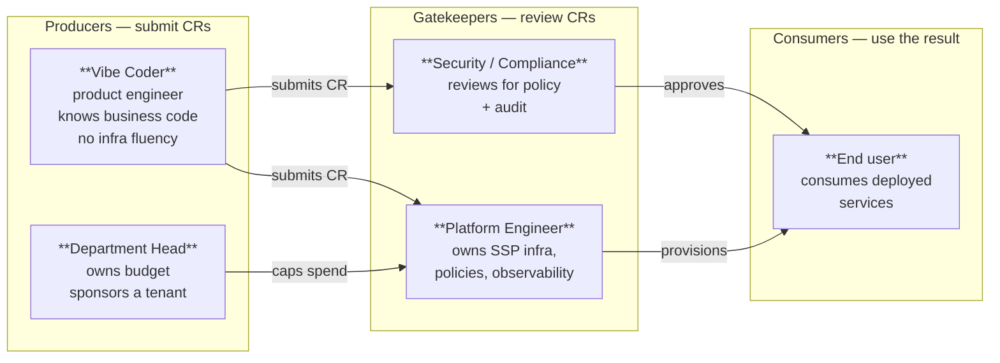
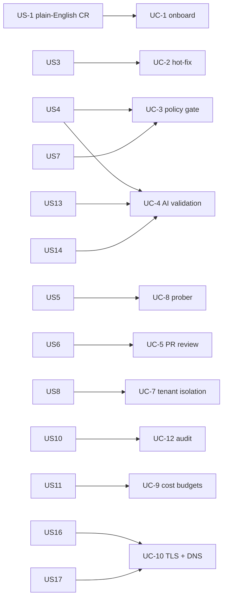

# 01 — User stories

Personas, their motivations, and the stories each one wants the Self-Service Portal
to satisfy. Each story is referenced by its `US-#` ID in [`02-use-cases.md`](./02-use-cases.md).

## Personas

Why these five? Producers describe **what** they want; gatekeepers decide **whether and
how** it ships; consumers experience the result. The portal's value is collapsing the
producer→consumer latency without removing gatekeeper authority.

---

## P1 — Vibe Coder (primary persona)

Product engineer at Alice's HR team. Writes the business logic, knows Git, has shipped
to staging dozens of times. Has **never** opened a Terraform file or written a Helm
chart. Lives on tight product deadlines.

| ID | Story | Acceptance |
| --- | --- | --- |
| **US-1** | As a vibe coder, I want to describe my service in plain English so that I don't have to author Dockerfiles or Helm values myself. | Submitting a CR with a free-text description produces working artifacts. |
| **US-2** | As a vibe coder, I want a single URL to share with stakeholders so my work is reviewable in minutes, not days. | Service gets a stable FQDN under `*.ssp.mightybee.dev` with valid TLS. |
| **US-3** | As a vibe coder, I want to iterate on my service without re-onboarding it each time. | Hot-fix CRs against the same service work as a workflow — no recreate cycle. |
| **US-4** | As a vibe coder, I want to know immediately if my request was rejected and why, so I can fix it without waiting for human review. | Policy-gate + AI rejections include a structured reason, surfaced in the UI within seconds. |
| **US-5** | As a vibe coder, I want my running service to show as healthy / unhealthy in the portal so I don't have to learn `kubectl`. | Service detail page shows live readiness state per revision. |

## P2 — Platform Engineer

Owns the SSP infra, sets policy, on-call for the cluster. Wants every change to come
through a single auditable surface. Trusts AI as a fast first-pass, not as a sole gate.

| ID | Story | Acceptance |
| --- | --- | --- |
| **US-6** | As a platform engineer, I want every change to land as a reviewable PR so my approval gate is unchanged from any other code change. | Every CR opens a GitHub PR; merge is the only path to production. |
| **US-7** | As a platform engineer, I want hard rules (replica cap, registry allowlist, privileged-container ban) enforced before AI runs, so generative output can't bypass them. | A deterministic policy gate runs first; AI never sees an out-of-policy CR. |
| **US-8** | As a platform engineer, I want each tenant in its own namespace with its own quota and network policy, so a noisy or compromised tenant can't affect a peer. | Tenant Terraform module provisions namespace, ResourceQuota, NetworkPolicy, IRSA per tenant. |
| **US-9** | As a platform engineer, I want one place to ship a change to the platform itself (the portal) and have it roll out, the same way tenants ship. | Portal Helm chart lives in fleet repo; ArgoCD reconciles. |
| **US-10** | As a platform engineer, I want a full audit trail of every CR's state transitions so I can debug "why did this end up broken?" weeks later. | `change_requests.status_history` JSONB log of every transition with `at` + `detail`. |

## P3 — Department Head / Tenant Owner

Accountable for the tenant's cost line. Doesn't ship code, doesn't review PRs. Cares
about: monthly bill, who's running what, when the line goes vertical.

| ID | Story | Acceptance |
| --- | --- | --- |
| **US-11** | As a department head, I want a monthly soft cap on my tenant's spend, with alerts before I hit it. | AWS Budget per `cost_center` with 50/80/100% notifications. |
| **US-12** | As a department head, I want spend attributable to each product so I can have a conversation with the team that owns it. | Cost allocation tags activated on `tenant`, `product`, `cost_center`, `environment`. |

## P4 — Security / Compliance

Reads the PR. Wants the change to be self-explanatory (no opaque YAML), with a clear
reason and a reversible path. Cares about: data residency, registry provenance, who
authorized what.

| ID | Story | Acceptance |
| --- | --- | --- |
| **US-13** | As a security reviewer, I want the AI's reasoning attached to each PR so I'm reviewing intent, not just code. | PR body includes the AI's summary, the originating CR ID, and the policy verdict. |
| **US-14** | As a security reviewer, I want image sources restricted to a known allowlist so a CR can't pull arbitrary docker.io user content. | AI validation rejects images outside `docker.io/library`, `gcr.io/distroless`, `public.ecr.aws/*`, `ghcr.io`, or the tenant ECR. |
| **US-15** | As a security reviewer, I want CI to push to ECR without a long-lived static key. | GHA uses GitHub OIDC; ECR push role assumed per-run. |

## P5 — End user (of the deployed services)

Doesn't care about the SSP. Cares whether the URL works.

| ID | Story | Acceptance |
| --- | --- | --- |
| **US-16** | As an end user, I expect the service URL to use real, browser-trusted TLS. | Wildcard ACM cert on `*.ssp.mightybee.dev`; HSTS enabled. |
| **US-17** | As an end user, I expect HTTP attacks (SQLi, XSS, scanner traffic) to be filtered before they reach the app. | WAFv2 with AWS managed common + known-bad-inputs rule groups in front of the ALB. |

---

## Story → use-case map

Full feature definitions live in [`02-use-cases.md`](./02-use-cases.md).
