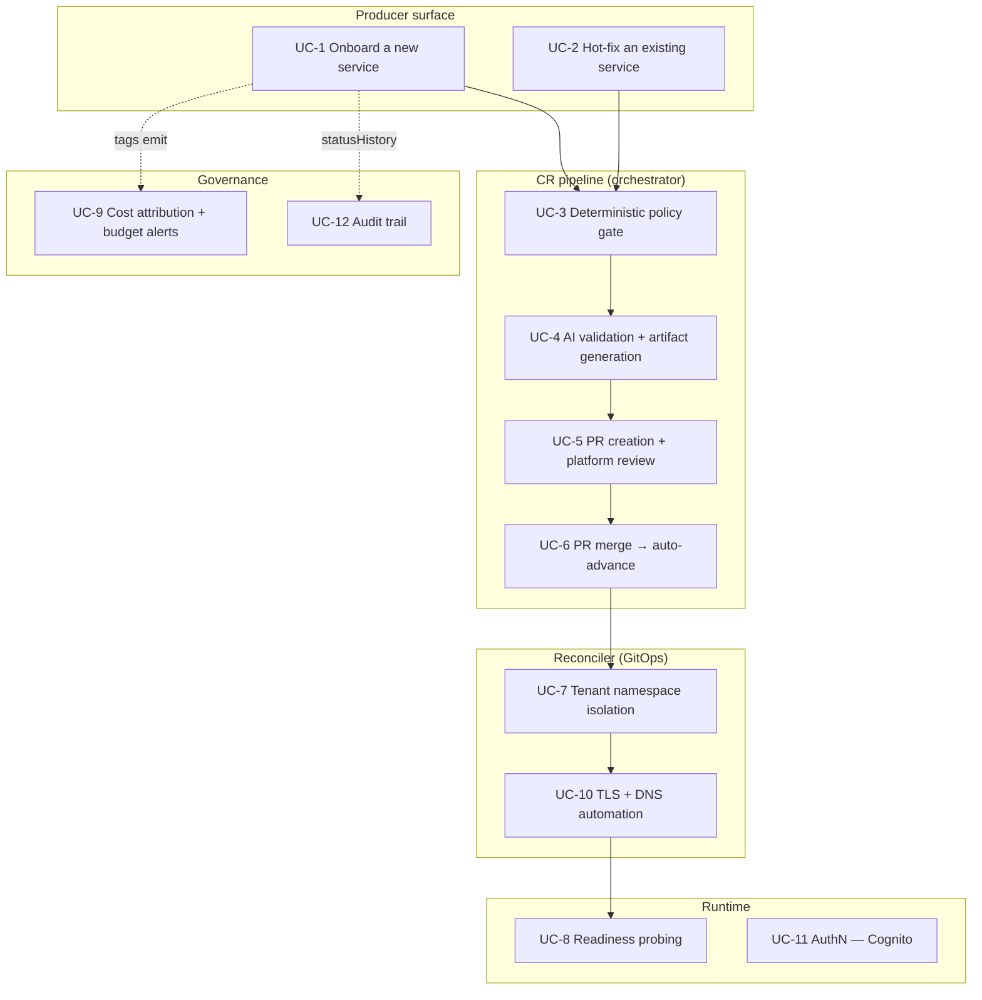
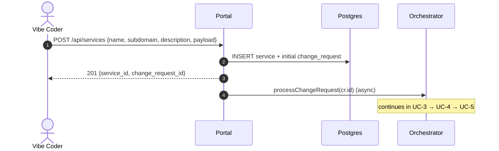
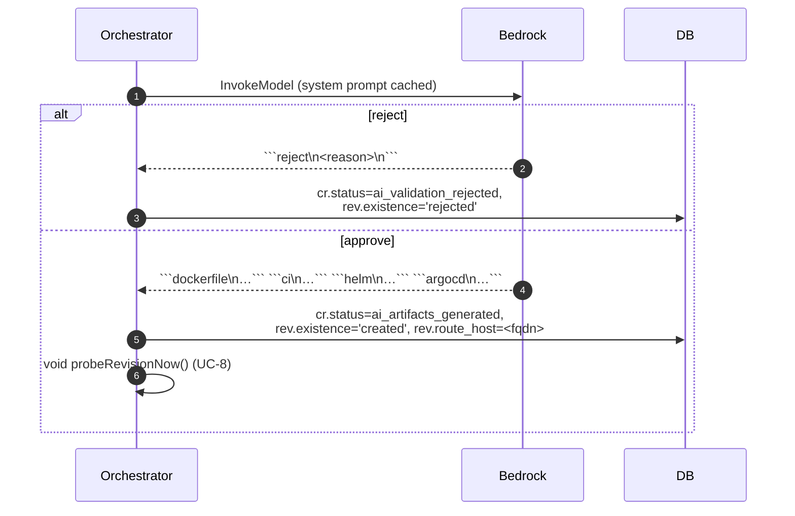
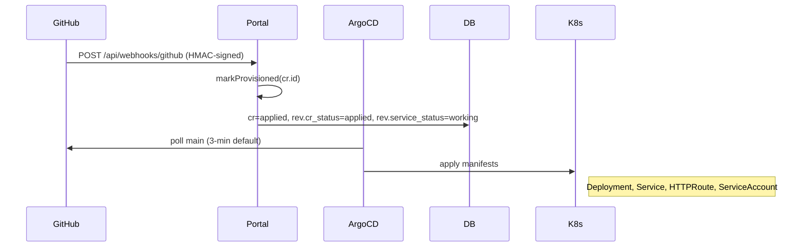
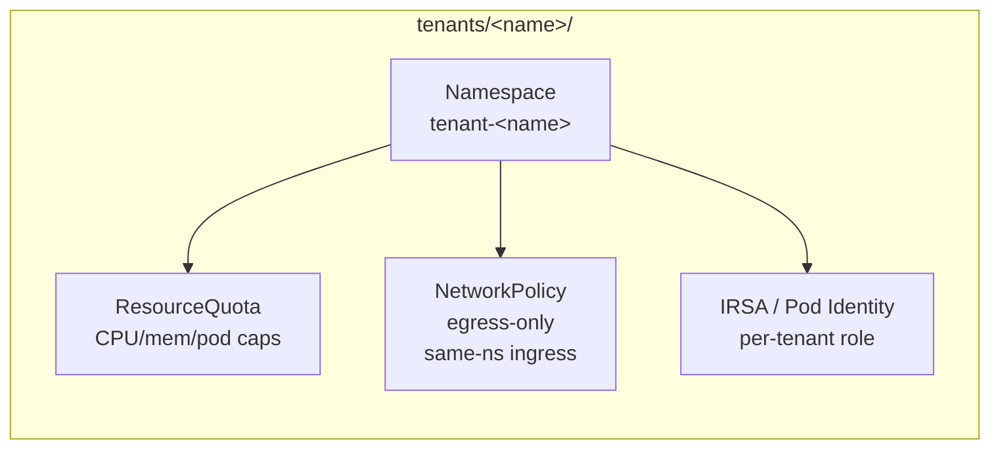
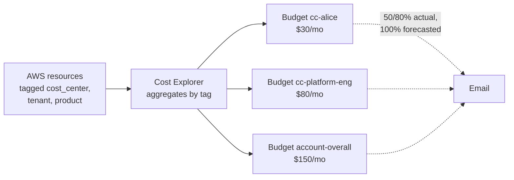
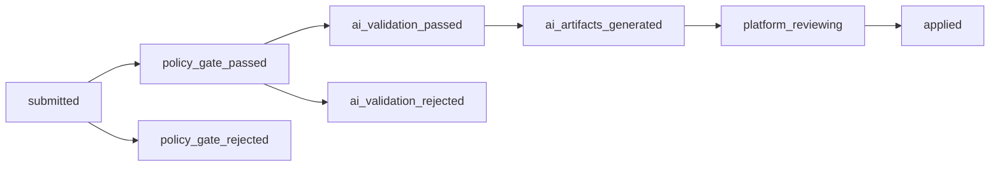

# 02 — Use cases

How the portal's features are exercised, and which user stories each one closes.
Each use case has the actor, trigger, the path through the system, and a sequence
diagram. User-story IDs link back to [`01-user-stories.md`](./01-user-stories.md).

## Feature map



---

## UC-1 — Onboard a new service

**Closes:** US-1, US-2  
**Actor:** Vibe Coder  
**Trigger:** Submits the "new service" form (or POSTs `/api/services`).



Service exists in DB with status `na`. The CR enters the pipeline.

## UC-2 — Hot-fix an existing service

**Closes:** US-3  
**Actor:** Vibe Coder  
**Trigger:** Submits a new CR against an existing service.

Identical pipeline to UC-1 except the service row already exists. Each new CR produces
exactly one new revision (1:1 invariant enforced by `service_revisions.change_request_id`
unique index). The latest revision drives `service.currentStatus`.

Proof: api-service shipped three CRs in this account — initial (broken cert), 1-level
re-route hot-fix, image swap to nginx. Each landed as its own revision row; the latest
flipped existing routing without recreating the service.

## UC-3 — Deterministic policy gate

**Closes:** US-4, US-7  
**Actor:** System (`src/lib/policy/gate.ts`)  
**Trigger:** Every CR, before AI runs.

Rules enforced today:
- Description ≥ 20 chars (it's the AI's input — too thin = bad output).
- `git_repo` is a valid `https://` URL.
- Subdomain matches `^[a-z0-9-]+$` OR `^[a-z0-9-]+\.ssp\.mightybee\.dev$`. Deeper
  subdomains are rejected because the wildcard cert covers only one level.
- Subdomain unique within tenant.
- Tenant not soft-deleted.

Failures write `policy_gate_rejected` into `change_requests.status` and mark the
revision `existence_status='rejected'` — never invokes Bedrock, so no AI cost.

## UC-4 — AI validation + artifact generation

**Closes:** US-4, US-13, US-14  
**Actor:** System (`src/lib/ai/agent.ts` + Bedrock Claude Opus 4.6)  
**Trigger:** Policy gate passed.



Allowlists enforced in the system prompt:
- **Image registries:** `docker.io/library/*`, `gcr.io/distroless/*`, `public.ecr.aws/*`,
  `ghcr.io/*`, or the tenant's own ECR.
- **ArgoCD Application name:** must be `<tenant>-<service>` (deterministic — two CRs
  against the same service can never produce different Application names, otherwise
  app-of-apps would orphan the prior deployment).
- **Application finalizer:** `resources-finalizer.argocd.argoproj.io` so cascade-delete
  cleans up children if the Application is ever removed.

## UC-5 — PR creation + platform review

**Closes:** US-6, US-13  
**Actor:** Platform Engineer  
**Trigger:** AI artifacts generated.

The orchestrator commits the four artifacts (Dockerfile, build.yml, values.yaml,
ArgoCD app) on a branch and opens a PR with body containing the CR ID, AI summary,
and a diff link. CR moves to `platform_reviewing`. Reviewer's options:
- **Merge** → UC-6 fires.
- **Close** → no advance; CR remains in `platform_reviewing` (manual operator action).

## UC-6 — PR merge → auto-advance

**Closes:** US-6, US-10  
**Actor:** GitHub webhook → `/api/webhooks/github`  
**Trigger:** PR.merged=true.



Webhook HMAC is verified against `SSP_GITHUB_WEBHOOK_SECRET` from AWS Secrets Manager —
not the WAF's job (defense in depth: WAF lets the path through; the app proves caller
identity).

## UC-7 — Tenant namespace isolation

**Closes:** US-8  
**Actor:** Platform Engineer (one-time per tenant)  
**Trigger:** `terraform apply` in `foundation/tenants/<name>/`.



A new tenant is one file: copy `tenants/alice/`, change the name. ArgoCD then routes
`tenant-<name>`-scoped Applications into it.

## UC-8 — Readiness probing

**Closes:** US-5  
**Actor:** System (`src/lib/workflow/prober.ts`)  
**Trigger:** Two paths.

1. **Immediate** — orchestrator fires `probeRevisionNow()` the moment a revision
   flips to `existence='created'`, so the badge isn't stuck at "probing" for ~60s.
2. **Periodic** — every 60s, the prober selects `DISTINCT ON (service_id)` the latest
   revision per service and HTTP-GETs its `route_host`. 2xx-3xx → `healthy`, anything
   else → `unhealthy`. Result is mirrored onto `service.currentStatus` so list pages
   don't need a JOIN.

Older (superseded) revisions are **not** re-probed — their last health value is frozen
as a historical snapshot. The prober is gated by `SSP_PORTAL_PROBER=true`; only the
portal Deployment sets it, so tenant pods (which boot the same image as a placeholder)
don't spin up duplicate probers.

## UC-9 — Cost attribution + budget alerts

**Closes:** US-11, US-12  
**Actor:** Department Head (recipient) / Platform Engineer (configurator)  
**Trigger:** Spend crosses a threshold.



Defined in [`fleet-managers/terraform/foundation/80-cost-governance/`](../fleet-managers/terraform/foundation/80-cost-governance/).
Two console-only activations needed (Cost Explorer + cost-allocation tag activation) —
both documented in that module's README.

## UC-10 — TLS + DNS automation

**Closes:** US-2, US-16, US-17  
**Actor:** System (LBC + ExternalDNS + cert-manager-controlled ACM)  
**Trigger:** HTTPRoute lands in a tenant namespace with the right label.

```mermaid
sequenceDiagram
  participant Helm
  participant K8s
  participant LBC as ALB Controller
  participant XDNS as ExternalDNS
  participant R53 as Route53
  participant ALB
  Helm->>K8s: HTTPRoute {host: foo.ssp.mightybee.dev}
  K8s-->>LBC: watch event
  LBC->>ALB: register IP target + listener rule
  K8s-->>XDNS: watch event
  XDNS->>R53: A foo.ssp.mightybee.dev → ALB DNS
  Note over ALB: ACM wildcard *.ssp.mightybee.dev attached;<br/>WAFv2 evaluates each request first
```

## UC-11 — AuthN via Cognito

**Closes:** US-6 (indirect)  
**Actor:** Vibe Coder  
**Trigger:** First request without a session cookie.

OIDC flow against `eu-west-1_zEVRIg5JY`. MVP1 uses `AUTH_MODE=stub` to make local
testing trivial; production flips to the real Cognito flow.

## UC-12 — Audit trail

**Closes:** US-10  
**Actor:** Platform Engineer (consumer)  
**Trigger:** Reading any CR detail page or querying `change_requests`.

Every state transition appends to `change_requests.status_history` as
`{status, at, detail?}`. The orchestrator never deletes from this array — only
appends — so weeks later you can reconstruct exactly which step rejected a CR and why.


