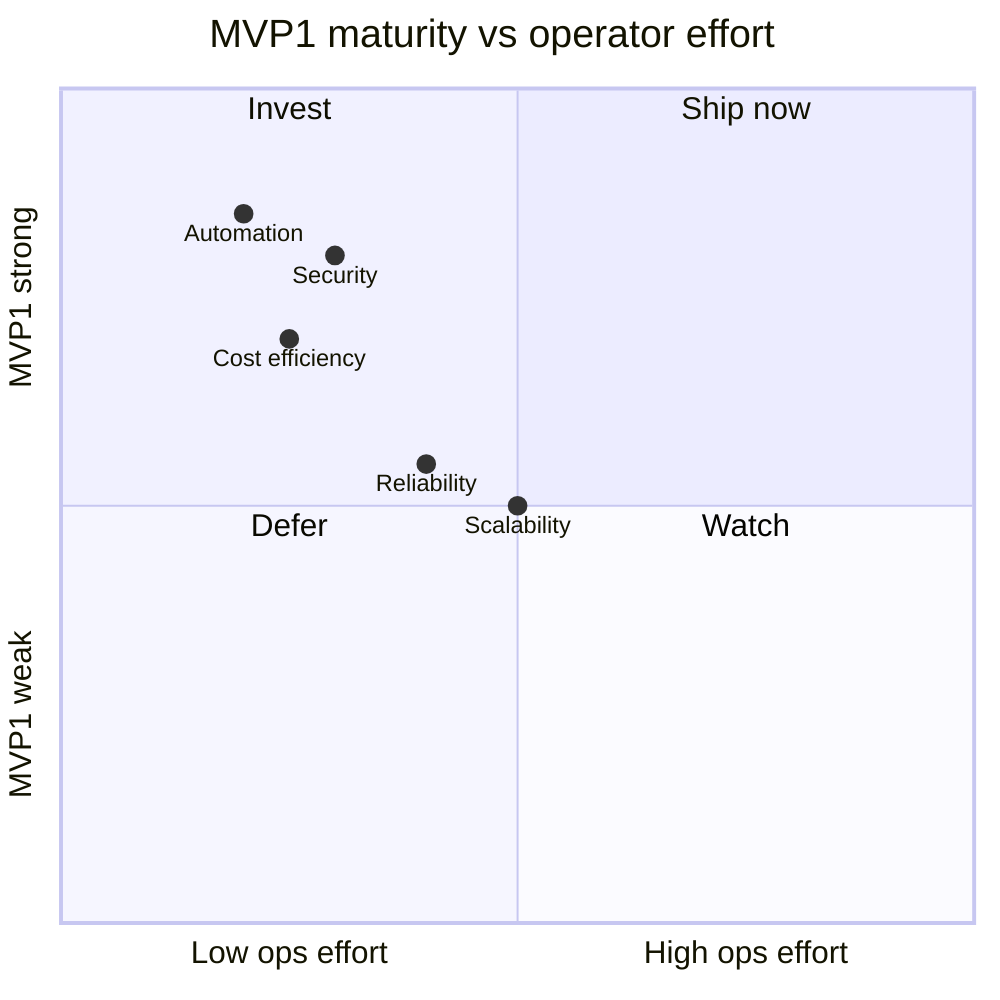
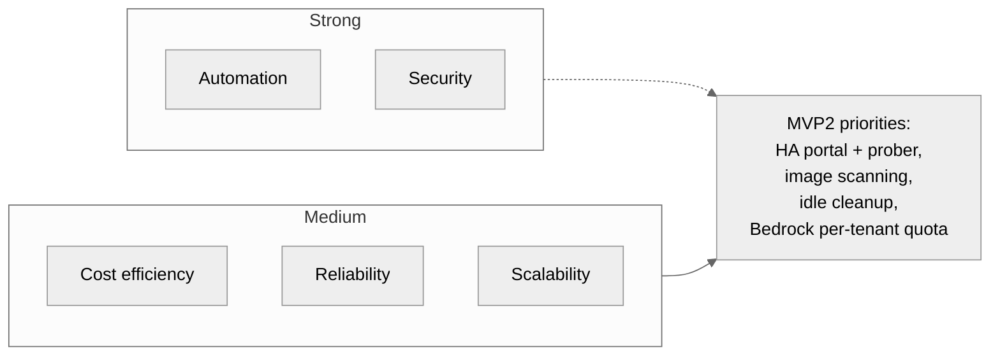

# 03 — Qualification

How the SSP scores on the five qualities a platform is usually judged on. For each
quality: what's in the codebase today, what's not yet, and the gap honest readers
should know about.

## Scorecard

Higher-Y = MVP1 already delivers value. Lower-X = the operator doesn't have to babysit.

---

## 1. Automation

**Score:** **strong** — end-to-end CR→deployed in ~3 minutes with zero human keystrokes
between submit and PR review.

### Done

| Capability | Where |
| --- | --- |
| AI generates Dockerfile, GHA build workflow, Helm values, ArgoCD Application from one CR | `llm-product-poc/src/lib/ai/agent.ts`, `prompts.ts` |
| Deterministic policy gate before AI | `llm-product-poc/src/lib/policy/gate.ts` |
| GitOps reconciliation — fleet repo is the source of truth | `fleet-managers/argocd/` (app-of-apps), ArgoCD watches recursively |
| ExternalDNS auto-publishes A records from HTTPRoute hostnames | `foundation/40-platform-addons/` |
| ACM wildcard cert attached automatically to ALB listeners | `foundation/15-dns/`, `LoadBalancerConfiguration` |
| GHA → ECR via OIDC, no static IAM keys | `foundation/55-ecr/`, repo `.github/workflows/build-portal.yml` |
| PR-merge webhook auto-advances CR to `applied` | `src/app/api/webhooks/github/route.ts` |
| ImmediateProbe on `existence='created'` | `src/lib/workflow/prober.ts::probeRevisionNow` |

### Not yet

- AI-generated values include `replicas`, `image`, `port` but **no HPA**. A tenant
  can't autoscale yet.
- No rollback automation. If a PR merges and the deployment breaks, the operator
  has to revert the PR manually — no `argo rollouts` integration.
- No drift detection beyond ArgoCD's built-in selfHeal. Out-of-band kubectl edits
  in tenant namespaces get reverted but not surfaced as alerts.

---

## 2. Scalability

**Score:** **medium** — the shared infrastructure is multi-tenant-ready in shape, but
hasn't been load-tested past the POC's single tenant.

### Done

| Capability | Where |
| --- | --- |
| Shared ALB / Gateway with per-tenant HTTPRoutes (namespace label selector) | `foundation/40-platform-addons/`, Gateway `allowedRoutes` |
| Per-tenant Kubernetes namespace, NetworkPolicy, ResourceQuota, IRSA | `foundation/tenants/<name>/` |
| Shared RDS for the portal — tenants don't share this DB | `foundation/60-portal-data/` |
| ECR repo per service via OIDC, no shared push role | `foundation/55-ecr/` |
| Orchestrator is stateless; portal Deployment can scale replicas (currently 1) | `platform-apps/ssp-portal/values.yaml` |

### Not yet

- The prober uses `setInterval` in-process. **Single replica only** — running two
  portal replicas would double-probe and race on `service.currentStatus`. MVP2 moves
  this to a CronJob / Argo Events.
- No multi-region — single eu-west-1 deployment.
- EKS managed node group is fixed `min/max`; not Karpenter / Cluster Autoscaler.
  A noisy tenant can starve scheduling on the existing nodes (we saw this when a
  kubelet wedged on one node and the surviving node was at its pod limit).
- AI calls aren't rate-limited at the orchestrator — Bedrock throttles us at ~6
  requests/7s. We documented this; we haven't fronted it with a queue.

---

## 3. Reliability

**Score:** **medium** — happy path is robust, recovery automation is light.

### Done

| Capability | Where |
| --- | --- |
| ArgoCD `selfHeal: true` on every Application | AI prompt enforces this, `prompts.ts` |
| Application finalizer cascades children on delete | `prompts.ts` + `agent.ts` |
| Status-history append-only audit log | `change_requests.status_history` |
| Readiness probing decoupled from existence: latest revision per service drives `service.currentStatus` | `prober.ts` `DISTINCT ON (service_id) ... ORDER BY created_at DESC` |
| Idempotent CR upsert — re-running orchestrator on the same CR doesn't dupe rows | unique index `service_revisions(change_request_id)` |
| EKS managed node group auto-replaces failed instances | tested live this session: terminated one wedged node, ASG replaced in ~5min |
| Postgres backups via RDS automatic snapshots | `foundation/60-portal-data/` (RDS default retention) |

### Not yet

- No multi-AZ database. RDS instance is single-AZ.
- No portal HA (single replica — see Scalability note about the prober).
- The prober's HTTP check is a binary 2xx-3xx test. A 200 from a crash-loop pod that
  serves an error page would register as healthy. Need richer probes (per-service
  `/healthz`, expected response body).
- Webhook delivery is best-effort. If GitHub retries fail, the CR is stuck at
  `platform_reviewing` even though the PR merged — the manual `mark-provisioned`
  endpoint exists but isn't surfaced in the UI.

---

## 4. Security

**Score:** **strong** for MVP1 — six independent defenses. See [`guardrails.md`](./guardrails.md).

### Done

| Defense | Where |
| --- | --- |
| WAFv2 — AWS managed common + known-bad-inputs rule groups, plus narrow allows for `/api/webhooks/*` and the argocd hostname | `foundation/45-waf/main.tf` |
| Deterministic policy gate (UC-3) — runs BEFORE AI, can't be talked around | `policy/gate.ts` |
| AI allowlist for image registries — refuses arbitrary `docker.io/<user>` content | `prompts.ts` |
| AI denial pattern — `privileged: true`, `hostNetwork: true`, `hostPath` mounts → rejected | `prompts.ts` rules |
| GitHub PR review = human gate; nothing reaches the cluster until merge | by construction |
| ECR push via GitHub OIDC, no static keys | `foundation/55-ecr/` |
| Per-tenant NetworkPolicy + ResourceQuota | `foundation/tenants/<name>/` |
| Webhook HMAC verification (defense in depth alongside WAF allow) | `src/app/api/webhooks/github/route.ts` |
| KMS-encrypted secrets in Secrets Manager, synced via External Secrets Operator | `foundation/00-bootstrap/kms.tf`, ESO config |
| TLS termination at ALB with ACM wildcard | `foundation/15-dns/` |
| One-level FQDN convention — wildcard cert actually covers what we deploy (lesson learned this session: two-level FQDNs broke TLS) | `policy/gate.ts` subdomain regex |

### Not yet

- No image-vulnerability scanning. ECR scan-on-push exists as a feature but isn't
  enabled in `foundation/55-ecr/`.
- No PodSecurityAdmission (PSA) labels on tenant namespaces. NetworkPolicy is on, but
  `restricted` PSA enforcement isn't.
- No secret rotation cadence on the portal's GitHub PAT or the webhook secret. Both
  live in Secrets Manager but aren't on a rotation schedule.
- Bedrock model invocations aren't bounded — no per-tenant quota. A malicious or
  buggy CR could fire many CRs to burn Bedrock spend (the budget alert catches it
  after the fact, not before).

---

## 5. Cost efficiency

**Score:** **medium** — shape is right (tag everything, budget per tenant), absolute
numbers small because the cluster is small.

### Done

| Capability | Where |
| --- | --- |
| Six-key tag schema applied via Terraform `default_tags` | `foundation/terraform.shared.tfvars` |
| Per-cost-center AWS Budget with 50/80% actual + 100% forecasted alerts | `foundation/80-cost-governance/` |
| Account-overall Budget catches untagged spend | same |
| CW log retention trimmed to 1 day across EKS control plane + WAF | `foundation/20-eks/main.tf`, `foundation/45-waf/main.tf` |
| EKS control-plane log types **disabled** for MVP1 — saves ingestion, not just storage | `foundation/20-eks/main.tf` `cluster_enabled_log_types = []` |
| Bedrock system-prompt cached (`cache_control: ephemeral`) — reduces per-CR cost | `src/lib/ai/agent.ts` |
| ALB + Gateway shared across all tenants (no per-tenant ALB) | `foundation/40-platform-addons/` |
| ECR lifecycle policies cap retained images (default 7 days for untagged) | `foundation/55-ecr/` |

### Not yet

- Cost Explorer + cost-allocation tag activation are **console-only** steps that
  must be done manually by an account billing admin. Documented in
  [`foundation/80-cost-governance/README.md`](../fleet-managers/terraform/foundation/80-cost-governance/README.md) but the SSP itself
  can't perform them. Until done, per-cost-center budgets read $0.
- No idle-resource cleanup. A tenant that submits a CR, gets a deployment, then
  never uses it will pay for those pods forever.
- No Spot / Graviton — node group uses on-demand x86 instances.
- NAT Gateway data transfer is the biggest unattributable spend on a quiet account.
  Not split per-tenant (would need VPC Flow Logs analysis).
- No per-tenant Bedrock token accounting. We pay Bedrock; we can't tell whose CR
  spent how much.

---

## Summary

