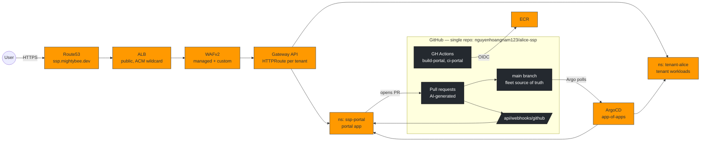
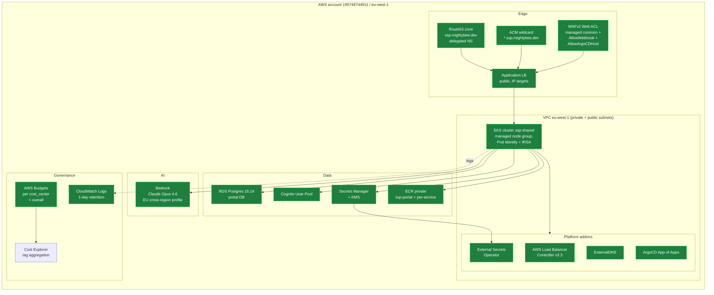
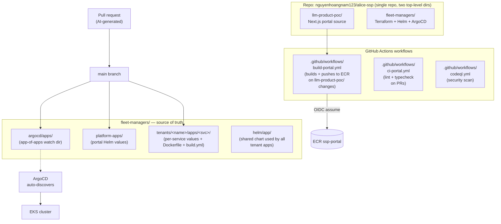
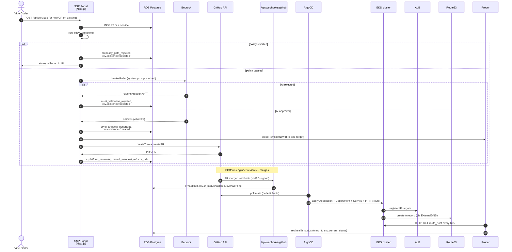

# 04 — Platform system design

Top-to-bottom view of what runs where, on which cloud surface, and how the two
external platforms (AWS, GitHub) compose. For deeper architectural rationale (why
Gateway API not Ingress, why ip-targets not instance-mode, etc.) see
[`architecture.md`](./architecture.md).

## High-level



---

## AWS topology



### Terraform module layout

```
fleet-managers/terraform/foundation/
├── 00-bootstrap/        # state backend (S3+DDB), KMS keys
├── 10-vpc/              # VPC, subnets, NAT, flow-log defaults
├── 15-dns/              # Route53 zone + ACM wildcard cert
├── 20-eks/              # EKS cluster, managed node group, CW retention 1d
├── 30-cognito/          # User Pool + app client
├── 40-platform-addons/  # LBC, ESO, ExternalDNS, ArgoCD (Helm via Terraform)
├── 45-waf/              # WAFv2 Web ACL + ALB association + log group 1d
├── 50-argocd/           # ArgoCD app-of-apps Application
├── 55-ecr/              # ECR repos + GitHub OIDC trust policy
├── 60-portal-data/      # RDS + parameter group + db credentials secret
├── 70-portal-app/       # Portal namespace, IRSA, ExternalSecrets for portal env
├── 80-cost-governance/  # AWS Budgets per cost_center + account overall
└── tenants/<name>/      # Per-tenant namespace, NetworkPolicy, ResourceQuota, IRSA
```

Each module has its own backend state key. Numbering is execution order — `00`
bootstraps the backend; everything else depends on it transitively.

### Tag schema

| Key | Example | Purpose |
| --- | --- | --- |
| `tenant` | `alice`, `platform-shared` | Per-tenant chargeback |
| `product` | `hr-portal`, `ssp-platform` | Per-product cost view |
| `environment` | `shared-prod` | Multi-env when relevant |
| `cost_center` | `alice`, `platform-eng` | Department chargeback (drives Budget filters) |
| `managed_by` | `terraform` | Distinguish IaC vs. click-ops |
| `owner` | `devops` | Escalation target |

Applied via Terraform `default_tags` in every provider block — every resource the
foundation creates carries all six.

---

## GitHub topology



### Branch model

- **main** — protected. Only path to production. Merge requires PR.
- **`ssp/<tenant>/<service>/cr-<id>`** — short-lived branches created by the
  orchestrator per CR. Auto-deleted on merge.

### Webhooks

- **PR merge** → `POST https://portal.ssp.mightybee.dev/api/webhooks/github`,
  HMAC-signed with `SSP_GITHUB_WEBHOOK_SECRET`. Handler calls `markProvisioned()`.
- WAF allows the path explicitly (priority 1 rule) — the app verifies the signature.

---

## End-to-end CR flow



End-to-end measured: ~3 minutes from CR submit to "deployed and probe-healthy" for an
approved CR, with no human input between submit and PR review.

---

## What's NOT in this picture (intentionally)

- **Helm provider from Terraform** — we use ArgoCD instead. Helm-via-Terraform was
  dropped because it conflates IaC drift with application drift.
- **Ingress resources** — Gateway API only. The wildcard `*.ssp.mightybee.dev` cert
  + single Gateway is the only public path.
- **Instance-mode ALB targets** — IP-targets only. Skips the NodePort hop entirely.
- **Per-tenant ALB / per-tenant cert** — one shared ALB and one wildcard cert. Costs
  flat regardless of tenant count.
- **Service mesh** — no Istio / Linkerd. NetworkPolicy + per-namespace IRSA is the
  isolation surface for MVP1.

---

## Operational handles

| Thing | Where |
| --- | --- |
| Portal URL | `https://portal.ssp.mightybee.dev` |
| ArgoCD UI | `https://argocd.ssp.mightybee.dev` |
| Fleet repo | `git@github.com:nguyenhoangnam123/alice-ssp.git` |
| Cluster | `aws eks update-kubeconfig --name ssp-shared --region eu-west-1 --profile alice` |
| Live CR DB | `kubectl -n ssp-portal exec deploy/ssp-portal-app -- node -e ...` (psql not installed in image) |
| Cost view | AWS Console → Billing → Cost Explorer (after activation per `80-cost-governance/README.md`) |
| Budget alerts | `aws budgets describe-budgets --account-id 195748744911 --profile alice` |
