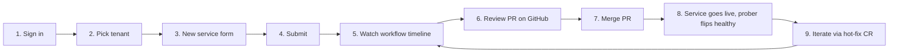
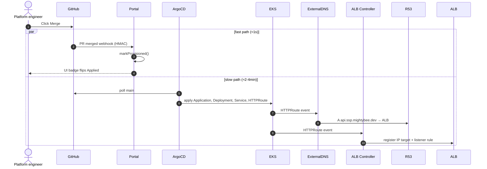

# 05 — Onboarding walkthrough

A concrete, end-to-end run from the user's browser at
`https://portal.ssp.mightybee.dev` through to a healthy public service. Every
URL, form value, and PR number in this doc is from the live api-service
onboarding done in this account — not invented.

> Read this **after** [`01-user-stories.md`](./01-user-stories.md) and
> [`02-use-cases.md`](./02-use-cases.md) — those say *why* and *what*; this
> says *exactly what you click*.

## Flow at a glance



---

## Step 1 — Sign in

Open https://portal.ssp.mightybee.dev. The portal is fronted by:

- Route53 `A api.ssp.mightybee.dev` → public ALB
- WAFv2 evaluates managed rule groups (common, known-bad-inputs)
- ACM wildcard `*.ssp.mightybee.dev` terminates TLS at the ALB

Auth runs against Cognito user pool `eu-west-1_zEVRIg5JY`. MVP1 ships with
`AUTH_MODE=stub` for fast local testing — production flips to the OIDC flow.

## Step 2 — Pick a tenant

Dashboard lists every tenant the signed-in user is an admin of (via the
`user_tenants` membership table). For this walkthrough the tenant is **alice**
(`tenant.id=cbdbfcd6373448318d82ddc58d`, `tenant.domain=alice`,
`cost_center=alice`).

Click the tenant → see its services. Click **New service**.

## Step 3 — Fill the new-service form

```mermaid
flowchart TB
  subgraph Form["POST /dashboard/services/new"]
    direction TB
    f1["tenant ▾ — alice"]
    f2["name — api-service<br/>(must match ^[a-z0-9-]+$)"]
    f3["subdomain — api<br/>(blank = internal-only;<br/>policy gate enforces<br/>1-level depth)"]
    f4["☐ VPN-only<br/>(checked = no public ALB)"]
    f5["git repo — https://github.com/<br/>nguyenhoangnam123/api-service"]
    f6["description — ≥20 chars<br/>the AI's prompt input"]
  end
  Form --> Action[("`Submit` → server action<br/>createService()")]
```

The exact values used in the live test:

| Field | Value |
| --- | --- |
| tenant | `alice` |
| name | `api-service` |
| subdomain | `api` |
| VPN-only | unchecked (publicly exposed) |
| git repo | `https://github.com/nguyenhoangnam123/api-service` |
| description | `Small public Node.js API service for the growth-experiments team. Two replicas, 200m CPU and 256Mi memory per pod. Reuses the SSP portal image at 195748744911.dkr.ecr.eu-west-1.amazonaws.com/ssp-portal:8de218fd...` |

Validation that fires **before** the workflow even starts:

- `name` matches `^[a-z0-9-]+$` (lowercase DNS-compatible)
- `git_repo` is a syntactically valid `https://` URL
- `description` ≥ 20 chars (too thin = bad AI output)

## Step 4 — Submit

The server action `createService` (`src/app/dashboard/services/new/page.tsx`)
opens a single Postgres transaction:

```sql
INSERT INTO services (id, tenant_id, name, subdomain, ...) VALUES (...);
INSERT INTO change_requests (id, service_id, requested_by, summary, status)
  VALUES (..., 'submitted');
```

The submit handler fires the orchestrator **out-of-band** with
`processChangeRequest(crId).catch(...)` — no await — then redirects you to
`/dashboard/services/<id>`. You land on the service page with status
`na`, watching the timeline animate as the orchestrator runs.

## Step 5 — Watch the workflow timeline

The service detail page renders one row per CR with three badges:

```
6/3/2026, 2:07:23 AM   Initial submission: api-service   [Applied / integrated]  [● exists]  [♥ healthy]
```

Click the row to expand. Inside you see the full status history:

```mermaid
gantt
  title CR lifecycle (real timing from the api-service initial submission)
  dateFormat HH:mm:ss
  axisFormat %H:%M:%S
  section Pre-AI
  submitted : milestone, m1, 02:07:23, 0s
  policy_gate_passed (≈30ms) : 02:07:23, 1s
  section AI agent
  Bedrock InvokeModel (≈12s) : crit, 02:07:24, 13s
  ai_validation_passed : milestone, m2, 02:07:37, 0s
  ai_artifacts_generated : milestone, m3, 02:07:37, 0s
  section Hand-off
  PR opened (Octokit) : 02:07:37, 4s
  platform_reviewing : milestone, m4, 02:07:41, 0s
  section Human gate
  Awaiting review : platform_reviewing, 02:07:41, 30m
  applied (PR merged + webhook) : milestone, m5, 02:35:00, 0s
```



The badge progression on this single row:

1. **Submitted** (gray) — DB write only.
2. **Policy gate passed** (green) — deterministic checks ran.
3. **AI validation passed** (green) — Bedrock approved.
4. **AI artifacts generated** (info) — orchestrator wrote
   `existence_status='created'` and `route_host='api.ssp.mightybee.dev'`.
   The prober fires immediately (`probeRevisionNow` — fire-and-forget) so the
   health badge gets a real value within ~5s instead of waiting for the next
   60s interval.
5. **Platform reviewing** (yellow) — PR URL attached to the revision row;
   waiting on human.
6. **Applied / integrated** (green) — once you merge the PR, the GitHub
   webhook fires `markProvisioned()` and the badge flips.

## Step 6 — Review the PR on GitHub

The PR body links back to the CR. It contains four AI-generated files:

```
fleet-managers/
  argocd/apps/alice-api-service.yaml      ← ArgoCD Application (Application.metadata.name pinned to <tenant>-<service>)
  tenants/alice/apps/api-service/
    Dockerfile                            ← multi-stage, non-root, distroless
    build.yml                             ← GHA workflow, ECR push via OIDC
    values.yaml                           ← Helm values (image, replicas, route, resources)
```

You're reviewing **four small files** with the AI's reasoning attached as the
PR description — not a hand-written Helm chart and CI workflow. Total LOC is
typically under 100.

Real PRs from the live account, in chronological order on api-service:

| PR | Purpose | Merged |
| --- | --- | --- |
| [#14](https://github.com/nguyenhoangnam123/alice-ssp/pull/14) | Initial submission | yes |
| [#16](https://github.com/nguyenhoangnam123/alice-ssp/pull/16) | Hot-fix — re-route to one-level FQDN | yes |
| [#17](https://github.com/nguyenhoangnam123/alice-ssp/pull/17) | Hot-fix — swap image to `nginx:alpine` (real public 200) | yes |

## Step 7 — Merge

You click **Squash and merge**. Two things happen, in this order:

1. **GitHub webhook fires** → `POST /api/webhooks/github` (HMAC-verified
   against `SSP_GITHUB_WEBHOOK_SECRET` from Secrets Manager). The handler
   calls `markProvisioned(crId)`, which:
   - Appends a `status_history` entry: `{status: 'applied', detail: 'PR
     merged + ArgoCD synced'}`.
   - Updates the revision: `cr_status='applied'`, `service_status='working'`.
   - Updates the service: `currentStatus='working'`.

2. **ArgoCD's polling cycle** (default 3 min) notices the new commit on
   `main`. The app-of-apps watching `fleet-managers/argocd/` reconciles the
   new `Application/alice-api-service` into the cluster. That Application's
   own `syncPolicy.automated.selfHeal=true` then applies the Helm chart into
   `tenant-alice`.



## Step 8 — Service goes live, prober flips healthy

While ArgoCD reconciles, the prober keeps probing `route_host` every 60s.
For ~2-4 min during the rollout you'll see:

- `exists` badge ✓ (set at step 5 already)
- `unhealthy` badge ✗ (no pod listening yet, or pod not ready)

Once the Deployment surfaces a Ready pod, the ALB target health check passes,
ExternalDNS publishes the A record, and the next prober tick gets a 2xx-3xx.
The badge flips to **healthy**.

End user can now hit `https://api.ssp.mightybee.dev` and get a real response.

## Step 9 — Iterate with a hot-fix CR

Same service detail page → **Update service (new CR)** button. The same form,
but pre-populated with the service ID. Submit a CR whose `summary` describes
what you're changing and whose `payload` carries the diff intent.

Example payload from the actual hot-fix that swapped the image:

```json
{
  "summary": "Hot-fix v2: swap to nginx:alpine ... Nginx serves a static 200 on /, perfect for the prober.",
  "payload": {
    "replicaCount": 2,
    "image": {"repository": "docker.io/library/nginx", "tag": "alpine"},
    "service": {"port": 80},
    "containerPort": 80
  }
}
```

The orchestrator:
- Runs the same policy gate.
- Calls the AI with the **current** service state attached, so it generates a
  diff, not a fresh repository.
- Opens a new PR against the SAME branch convention
  (`ssp/<tenant>/<service>/cr-<short-id>`).
- The `ArgoCD Application.metadata.name` is **deterministic** (locked in the
  AI prompt to `<tenant>-<service>`) so app-of-apps updates the existing
  Application in place — it does **not** create a duplicate (we made that
  mistake once before pinning the name; the orphan Deployment + HTTPRoute
  fought over the same hostname until we cleaned them up).

A new revision row appears with its own existence + health. The older
revision's health is frozen at its last value (it's superseded; the prober
only probes the latest per service).

---

## Concrete artifacts produced by this walkthrough

These exist in the live account right now:

| Artifact | Where to look |
| --- | --- |
| Service record | `services` table, id `01KT4VQ06937KK4JNTCTJA20C8` |
| Three CR rows (initial + two hot-fixes) | `change_requests` table |
| Three revision rows | `service_revisions` table, latest is `existence='created', health='healthy', route_host='api.ssp.mightybee.dev'` |
| Three merged PRs | github.com/nguyenhoangnam123/alice-ssp/pull/14, 16, 17 |
| Three branches (auto-deleted on merge) | `ssp/alice/api-service/cr-{9ej8rezx,ak4003fk,x8d9ejwd}` |
| ArgoCD Application | `Application/alice-api-service` in namespace `argocd` |
| Live URL | https://api.ssp.mightybee.dev (200 OK, nginx welcome page) |
| Route53 record | `A api.ssp.mightybee.dev → k8s-gateways-albpubli-...elb.amazonaws.com` |

## Common failures and how the UI shows them

| What you did | What you'll see |
| --- | --- |
| Description < 20 chars | Server-side `Error` thrown before INSERT; form re-renders with the error |
| Subdomain with two dots (e.g. `api.prod`) | CR moves straight to `policy_gate_rejected`; revision row gets `existence='rejected'`, no AI call made |
| Image not on allowlist (e.g. `ealen/echo-server`) | CR moves to `ai_validation_rejected`; `status_history[].detail` cites the registry rule |
| Replicas > 20 | Policy gate rejects (replica cap is documented in `policy/gate.ts`) |
| Privileged container in payload | AI validation rejects with "platform forbids privileged: true" |
| All five passed | PR opens within ~15s of submit |

Each rejected revision lives forever in the timeline as audit evidence — you
can prove later that "we tried to ship X, the platform refused, here's why."
