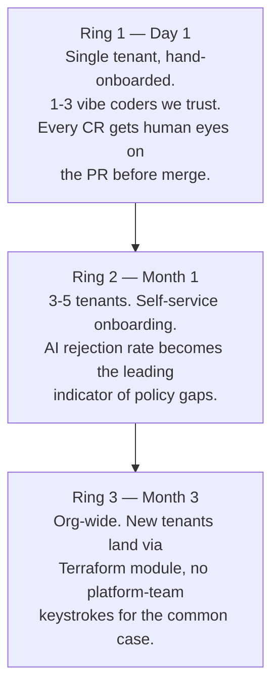

# 07 — Rollout shape

What ships first, what stays manual at launch, what unlocks the next 10x of apps.

## Three rings

---

## Ring 1 — What ships first

The thinnest slice that lets one vibe coder go from "I have a repo" to "I have a URL."

**Built and live:**
- One tenant (`alice`) with namespace + NetworkPolicy + ResourceQuota + IRSA.
- The CR workflow end-to-end: submit → policy gate → AI → PR → merge → reconcile.
- Wildcard `*.ssp.mightybee.dev` cert via ACM; ExternalDNS publishes A records.
- AWS Budgets per cost-center with email alerts at 50/80/100%.
- Audit trail (`status_history` JSONB) on every CR.

**What's intentionally manual at Ring 1:**
- **New tenant onboarding.** A platform engineer runs `terraform apply
  -target=module.tenant_<name>` and adds the user to `user_tenants`. Automating
  this is Ring 2's first job — once we see the patterns the manual onboarding
  needs.
- **Quota tuning.** ResourceQuotas use platform defaults (4 cores / 8Gi / 20
  pods). A tenant that wants more files a JIRA / Slack ask. We won't generalize
  the override path until we have ≥3 tenants pushing on it.
- **PR review.** Every CR's PR is reviewed by a human. No auto-merge for any
  bucket, no matter how trivial the change.

**What we still don't surface in the UI:**
- Cost — visible via AWS Console only. Adding a `/dashboard/costs` page is
  Ring 2.
- Bedrock token spend per tenant. Currently aggregated only at the AWS bill
  level. See [09-llm-observability.md](./09-llm-observability.md).

---

## Ring 2 — Month 1

What we'd ship next, ordered by signal:

1. **Self-service tenant onboarding.** Move the per-tenant Terraform module
   behind a CR flow itself: a "new tenant" CR opens a PR that creates the
   tenant namespace, IAM, quota, network policy. The platform team reviews the
   PR same way they review service CRs.

2. **Step Functions orchestrator.** Replace the in-process workflow. Buys
   durability (a portal restart no longer drops in-flight CRs), retries, and
   visualizable execution graphs. Unblocks portal HA.

3. **Auto-merge for low-risk CRs.** A CR that changes only `replicaCount`
   between 1–4, doesn't touch the image, and AI confidence is above a
   threshold can auto-merge after a 5-min delay (cool-off window for objections).
   Drops the human-gate latency from O(hours) to O(minutes).

4. **LLM observability MVP.** Implements the design in [09-llm-observability.md](./09-llm-observability.md):
   per-CR trace ID across orchestrator → Bedrock → GitHub, token cost per
   tenant, alarm on tail-latency regressions.

5. **PII scanning on CR descriptions** — see [10-prompt-injection-and-pii.md](./10-prompt-injection-and-pii.md).

6. **Cost view in the portal.** A `/dashboard/costs` page that queries Cost
   Explorer via IRSA and shows the rolling 30-day spend per tenant /
   cost_center / product. Closes the loop from US-12.

---

## Ring 3 — What unlocks the next 10x of apps

The platform stays usable from 5 → 50 apps **only if these are in place**:

1. **HA portal + HA prober.** Single replica is fine for a single tenant; not
   for fifty. Prober becomes a CronJob / Argo Events workflow so it survives
   portal restarts. Portal Deployment goes to replicas=2 with a leader election
   for orchestration (or moves the orchestrator out entirely — see Ring 2 item
   2).

2. **Image scanning + signature verification.** ECR scan-on-push enabled;
   admission controller verifies signed images only (Cosign / Notary). Otherwise
   the AI's image-registry allowlist is the only gate on "what runs."

3. **Per-tenant Bedrock budget.** Today a malicious or buggy vibe coder can
   fire many CRs in a loop and burn Bedrock spend — the budget alarm catches
   it after the fact, not before. Need a per-tenant rate-limit in the
   orchestrator that consults a cached spend value and refuses if over.

4. **Service retirement.** A "decommission" CR that scales the Deployment to
   0, drops the HTTPRoute, sets `service.deletedAt`, and revokes the IRSA role.
   Today the only path is `kubectl delete` + manual DB row tombstone.

5. **Secret rotation.** Schedule rotation on the portal's GitHub PAT and
   webhook secret via Secrets Manager + Lambda rotator. Currently both live
   forever once provisioned.

6. **Multi-region.** Single eu-west-1 cluster is OK for one country / one team;
   not for org-wide. The shape doesn't change (one cluster per region, same
   chart, fleet repo grows a `regions/` axis); the work is in the rollout
   pipeline and DNS strategy.

7. **Drift surfaces.** ArgoCD's selfHeal reverts out-of-band changes but
   doesn't alert on them. Wire `argocd app diff` results into a per-tenant
   feed so the platform team sees "alice tried to kubectl-patch something
   five times this week."

---

## What we're explicitly NOT doing in Ring 1

- No multi-AZ database.
- No service mesh (Istio / Linkerd) — NetworkPolicy + IRSA is the iso surface.
- No HPA in AI-generated values — replicas are static.
- No per-tenant ALB / per-tenant cert.
- No App Runner / Lambda escape hatch — everything is K8s.
- No SLO instrumentation (we have probes; not SLO budgets).

Most of these become Ring 2 or Ring 3 work once we have signal that they matter.
