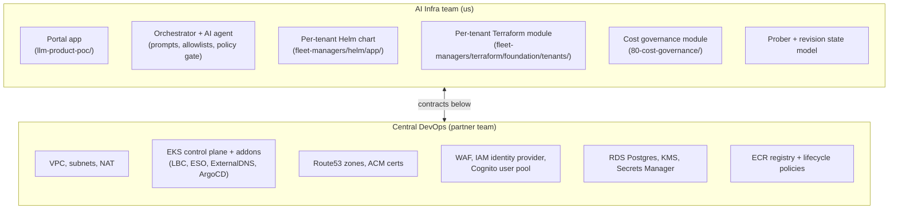

# 08 — Ownership: AI Infra vs DevOps

The spec asks us to be explicit about what the AI Infra Engineer owns versus what
the central DevOps team owns, and the contract between them. Two teams, one
platform, clean seam.

## Org map

---

## The boundary

| Concern | Owner | Why |
| --- | --- | --- |
| **VPC / subnets / NAT** | DevOps | Shared by every workload in the account. Lifetime measured in years. |
| **EKS control plane + managed addons** | DevOps | Cluster-wide; rotation cadence dictated by EKS LTS schedule. |
| **Route53 zones + ACM certs** | DevOps | Account-scope DNS / cert plane; renewal cadence is theirs. |
| **WAF web ACL** | DevOps owns the ACL; **AI Infra owns the rules specific to portal endpoints** (`/api/webhooks/*` allow, argocd-hostname allow) | The defaults are platform; the overrides are app-specific. |
| **Per-tenant Helm chart** (`helm/app/`) | AI Infra | This *is* our product. Every CR-generated values.yaml is a consumer. |
| **Per-tenant Terraform module** (`foundation/tenants/<name>/`) | AI Infra | Tenant isolation is a contract we sign with our users. |
| **Cost-governance Terraform module** (`80-cost-governance/`) | AI Infra | Defines per-cost-center budgets; we have to know who our tenants are. |
| **The AI prompt + policy gate** | AI Infra | Single biggest lever on quality and safety. DevOps shouldn't have an opinion. |
| **The portal app** (`llm-product-poc/`) | AI Infra | Source of every CR. |
| **ECR registry + lifecycle** | DevOps | Account-scope service; we get write via OIDC trust. |
| **RDS portal database** | DevOps owns the instance; AI Infra owns the schema | Operates Postgres they already operate; we model the workflow on top. |
| **Cognito user pool** | DevOps owns the pool; AI Infra owns the `user_tenants` membership model | They run the IdP; we decide who's an admin of what. |
| **Bedrock access + invocation IAM** | AI Infra | We pay for the tokens, we shape the prompts. |
| **Image scanning / signing policy** (Ring 3) | Joint — DevOps owns the controller, AI Infra owns the policy | The controller is platform machinery; what counts as "signed" is app-policy. |

---

## The contract — what crosses the seam

Three interface contracts; if either side breaks one, the other has to know.

### Contract 1: Network ingress

**DevOps provides:**
- Public ALB at a stable hostname (`k8s-gateways-albpubli-…elb.amazonaws.com`).
- ACM wildcard cert covering `*.ssp.mightybee.dev` attached to the ALB's 443
  listener.
- AWS Load Balancer Controller v3.3+ with the `ALBGatewayAPI` feature gate
  enabled.

**AI Infra consumes:** by labeling tenant namespaces with
`ssp.platform/tenant=<name>` so the shared Gateway's `allowedRoutes` selector
admits their HTTPRoutes.

**Breaks if:** DevOps disables ALBGatewayAPI, or rotates the cert ARN without
notifying us, or removes the wildcard scope.

### Contract 2: Per-tenant IAM seed

**DevOps provides:**
- EKS cluster with OIDC issuer URL exposed in Terraform remote state.
- Pod Identity agent addon installed.

**AI Infra consumes:** the per-tenant Terraform module attaches an IAM role to
the namespace via Pod Identity Association. We never modify DevOps-owned roles;
we only add roles scoped to our prefix (`ssp-tenant-<name>-*`).

**Breaks if:** OIDC issuer URL changes (e.g. cluster re-created), or the
prefix collides with a DevOps-owned role name.

### Contract 3: Secret plane

**DevOps provides:**
- AWS Secrets Manager with KMS key `alias/ssp-platform-secrets`.
- External Secrets Operator running cluster-wide with a `ClusterSecretStore`
  named `aws-secretsmanager`.

**AI Infra consumes:** every tenant's portal-side secrets (DB creds, GitHub
PAT, webhook HMAC) live under `ssp/portal/*`. Every tenant-app secret lives
under `ssp/<tenant>/<service>/*`. We never write the cluster store; we only
publish ExternalSecret resources that reference it.

**Breaks if:** the KMS key is rotated to a new alias without re-encrypting
secrets, or the ClusterSecretStore name changes.

---

## What happens at the seam in practice

Three concrete scenarios:

### "We want a new tenant"
1. AI Infra writes a new directory under
   `fleet-managers/terraform/foundation/tenants/<name>/`.
2. `terraform apply` creates: namespace, IRSA / Pod Identity association,
   NetworkPolicy, ResourceQuota.
3. DevOps doesn't touch a thing — the tenant module only uses contracts
   DevOps already publishes (cluster OIDC, ClusterSecretStore, KMS key).
4. AI Infra owns this end-to-end. If it fails, it's our pager.

### "We want to update EKS to 1.31"
1. DevOps writes the upgrade in `foundation/20-eks/`.
2. We don't review the upgrade itself — that's their judgment.
3. We **do** review whether any addon contracts change (LBC feature flags,
   ESO behavior). If yes, we adapt our chart in `helm/app/`.
4. DevOps pages us if the upgrade lands and one of our tenant apps breaks.

### "A vibe coder's CR generates a values.yaml that's malformed"
1. Our policy gate caught it (or didn't).
2. Our orchestrator's PR opens with bad YAML.
3. The platform engineer reviewing the PR catches it (US-6).
4. DevOps is not in this loop. If the AI is generating bad YAML, that's
   100% an AI Infra problem — prompts, allowlist, or examples need to change.

---

## Why this seam, not a different one

We considered drawing the boundary at "DevOps owns Terraform, AI Infra owns
the app." Rejected because:

- **Tenants need Terraform.** Per-tenant IAM, ResourceQuota, NetworkPolicy live
  in Terraform. If AI Infra can't write Terraform, every new tenant becomes a
  DevOps ask.
- **DevOps shouldn't review prompt changes.** The AI prompt is a product surface;
  central DevOps has no signal on whether a prompt change makes the platform
  better.
- **Coordination cost.** The current seam means AI Infra can ship from CR to
  live URL without a DevOps handoff in the common case. That's the spec's whole
  promise.

The seam follows the **resource lifetime**: things that live for years (VPC,
EKS, cert) → DevOps. Things that live for the duration of a product question
(tenant, service, prompt) → AI Infra.
