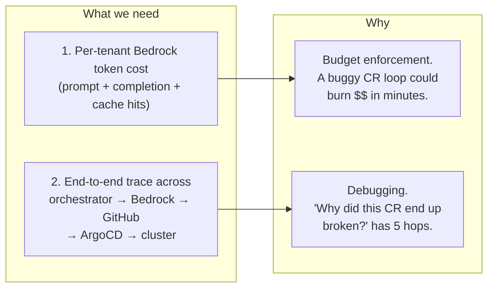
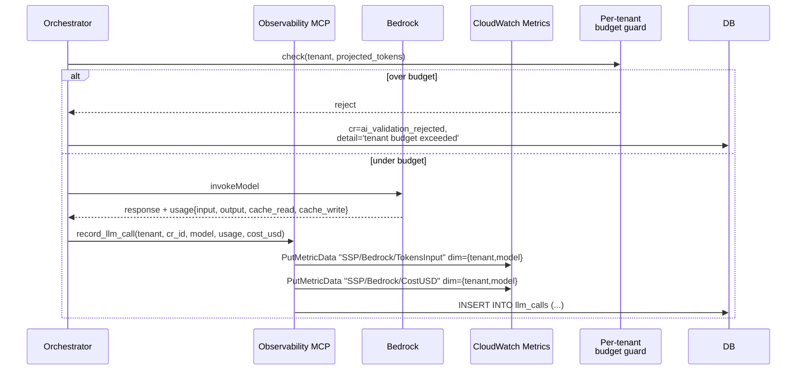
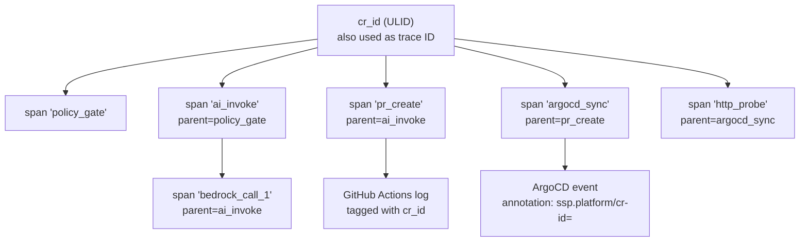

# 09 — LLM observability (token costs + agent tracing)

The spec calls out two AI-specific observability needs that the current portal
does **not** yet implement, only logs. This doc is the design that closes both
gaps — what we'd build before opening Ring 2.

> Status: **design only**, plus a small reference implementation in
> [`mcp-server/`](../mcp-server/) (Deliverable 2 Option B).

## Two things the platform must see



---

## Part 1 — Token cost as a first-class signal

### What we have today

- AWS Budget per `cost_center` with email alerts at 50/80/100%
  (`foundation/80-cost-governance/`). Catches Bedrock spend **after the fact**,
  aggregated at the AWS-bill level, with ~24h delay.
- Bedrock system prompt cached via `cache_control: ephemeral` so each CR is
  ~3K tokens of input instead of ~10K.

### Gap

- **No per-CR token accounting.** We can't say "CR `01KT4VQ06AV2VA98T79EJ8REZX`
  cost $0.012 in Opus tokens."
- **No per-tenant aggregation.** We can't say "alice burned $4.32 on Bedrock
  this week."
- **No real-time alarm.** A vibe coder's bug loop that submits 200 CRs in 5
  minutes blows through a daily budget before the budget alert even fires.

### Design



### Pieces

1. **`llm_calls` table** — append-only audit log of every Bedrock invocation.
   Columns: `id`, `cr_id` (nullable for non-CR calls), `tenant_id`, `model_id`,
   `input_tokens`, `output_tokens`, `cache_read_tokens`, `cache_write_tokens`,
   `cost_usd`, `latency_ms`, `created_at`. Cost computed from the model's
   posted USD/token rate (constants table in code; not pulled from AWS API per
   call).

2. **CloudWatch metric publish** — every `llm_calls` insert also pushes
   `SSP/Bedrock/TokensInput` and `SSP/Bedrock/CostUSD` with dimensions
   `{tenant_id, model_id}`. Lets us alarm on cost-rate (cents-per-minute) per
   tenant, not just total monthly spend.

3. **Budget guard** — before each Bedrock invoke, the orchestrator queries
   `SELECT COALESCE(SUM(cost_usd), 0) FROM llm_calls WHERE tenant_id=$1 AND
   created_at > date_trunc('month', now())` and refuses if the projected cost
   (current + max-expected for this call) would exceed the tenant's
   `bedrock_monthly_cap_usd`. Cap stored on `tenants` table.

4. **Per-tenant dashboard line** — Cost Explorer for the AWS bill view;
   `/dashboard/tenants/<id>` shows live monthly Bedrock spend from `llm_calls`
   (sub-second freshness).

### Implementation surface

```ts
// src/lib/observability/bedrock-meter.ts (new)
export async function meteredInvoke(args: {
  tenantId: string;
  crId?: string;
  model: string;
  body: any;
}): Promise<BedrockResponse> {
  await ensureUnderBudget(args.tenantId, args.model);
  const t0 = Date.now();
  const res = await bedrockClient.send(new InvokeModelCommand({...}));
  const usage = res.usage;
  const cost = computeCost(args.model, usage);
  await db.insert(llmCalls).values({
    tenantId: args.tenantId, crId: args.crId, modelId: args.model,
    inputTokens: usage.input_tokens, outputTokens: usage.output_tokens,
    cacheReadTokens: usage.cache_read_input_tokens,
    costUsd: cost, latencyMs: Date.now() - t0,
  });
  await cw.send(new PutMetricDataCommand({...}));
  return res;
}
```

Plumbed in by replacing the direct `bedrockClient.send(...)` in
`src/lib/ai/agent.ts` with `meteredInvoke(...)`.

---

## Part 2 — Tracing across the agent / tool-call chain

### What we have today

- One stdout log line per orchestrator phase, written by `console.log()`.
  Grep-able in CloudWatch (when CW retention isn't 1 day).
- `status_history` JSONB column gives the user-facing milestones but no timings,
  no error context, no causal links to GitHub / ArgoCD events.

### Gap

A CR that ends up `applied` but the deployment misbehaves needs the engineer to
correlate **five log surfaces**: portal stdout, Bedrock CloudTrail (yes/no
invocation), GitHub Actions log (build), ArgoCD reconcile log, EKS event
stream. There's no shared trace ID across these.

### Design

**One trace ID per CR**, attached to every emit downstream:



### Pieces

1. **MCP `emit_span` tool** — see [`mcp-server/`](../mcp-server/). Three calls:
   `start_span`, `end_span`, `set_attribute`. Spans land as JSON-lines on
   stdout (CloudWatch parses them as Embedded Metric Format) and optionally
   to an OTel collector if `OTEL_EXPORTER_OTLP_ENDPOINT` is set.

2. **CR-ID propagation through GitHub** — the AI-generated `build.yml` includes
   `env: SSP_CR_ID: ${{ vars.SSP_CR_ID }}` and the PR-creation step pushes
   the CR ID as a repo variable. Workflow steps emit it on every log line so a
   grep on the trace ID surfaces both portal logs AND GHA logs.

3. **CR-ID propagation through ArgoCD** — the AI prompt is updated to set
   `Application.metadata.annotations["ssp.platform/cr-id"]`. ArgoCD events
   inherit annotations. Cluster events with the annotation get scraped into
   the same trace.

4. **Probe results into the trace** — `prober.ts::probeOne` opens a span when
   it probes, tags it with the revision ID, and closes it with status. So a
   "why did this become unhealthy 4 hours ago?" answer is one query.

### What an end-to-end trace looks like

```
[T0]      policy_gate              cr=01K...    duration=28ms   ok
[T0+30ms] ai_invoke                                              parent=cr
[T0+30ms]   bedrock_call           model=opus    in=2843 out=812  cost=$0.018 latency=11.2s
[T11s]    pr_create                pr_number=14   latency=3.4s
[T15s]    cr_state=platform_reviewing
[T31m]    pr_merge_webhook         hmac_ok=true
[T31m]    cr_state=applied
[T34m]    argocd_sync              annotation:cr-id=01K... healthy=true
[T34m]    probe                    revision_id=...  status=200  health=healthy
```

One filter on `cr=01K…` returns the entire chain. Today: five separate
queries with no join key.

---

## What ships when

- **Token accounting (Part 1)** is Ring 2 work, blocking the
  per-tenant rate limit in Ring 3.
- **Tracing (Part 2)** ships incrementally:
  - **Phase 1** (Ring 1, almost-there): the MCP server in `mcp-server/` lives
    in this repo as a runnable spec.
  - **Phase 2** (Ring 2): orchestrator emits spans via the MCP. Cluster events
    get the annotation.
  - **Phase 3** (Ring 3): OTel collector + Jaeger / Tempo in-cluster.
