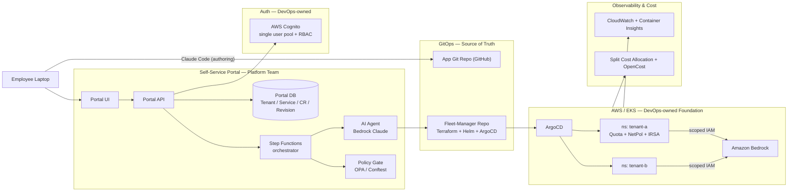
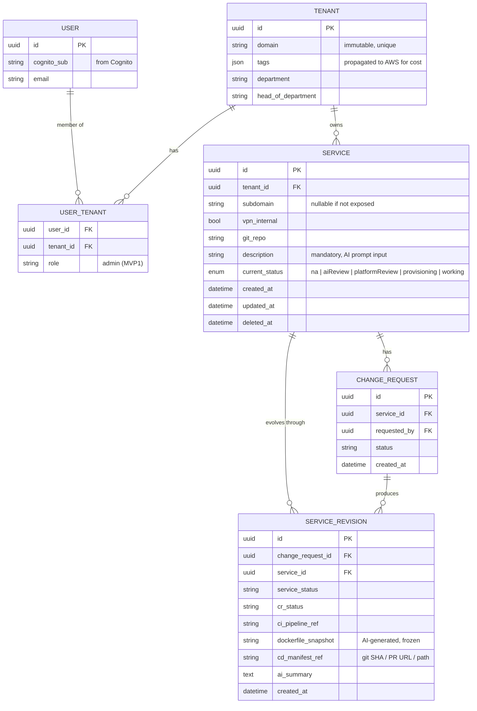
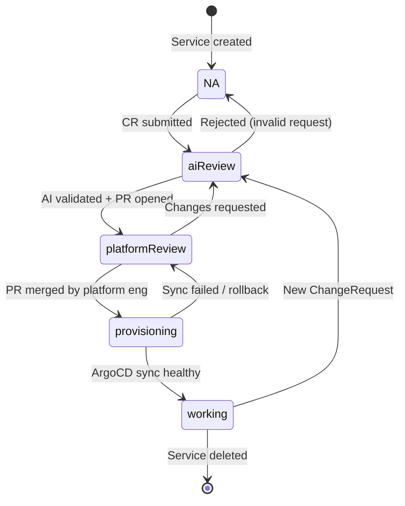
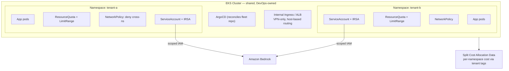

# SSP Architecture

Five views — all editable Mermaid. Re-render with any Mermaid-aware tool.

## 1. System architecture



## 2. Authoritative provisioning workflow

```mermaid
sequenceDiagram
    actor U as User (Cognito)
    participant P as Portal API
    participant SF as Step Functions
    participant AI as AI Agent (Bedrock)
    participant POL as Policy Gate (OPA)
    participant FM as Fleet Repo (GitHub)
    participant PE as Platform Engineer
    participant AR as ArgoCD
    participant K as EKS
    participant SNS as SNS Fanout

    U->>P: Submit service / ChangeRequest<br/>(git repo, domain, resources, description)
    P->>P: RBAC check (UserTenant); write CR + Revision
    P->>SF: Start workflow
    Note over SF: status: aiReview
    SF->>SNS: notify (aiReview)
    SF->>AI: Review request + repo + CR history
    AI->>POL: Deterministic checks<br/>(quota, Dockerfile, domain free)
    alt Gaps found (no Dockerfile / CI)
        AI->>AI: Generate Dockerfile / CI / manifests
    end
    AI->>FM: Open PR (Terraform + Helm + ArgoCD)
    Note over SF: status: platformReview
    SF->>SNS: notify (platformReview)
    PE->>FM: Review & merge PR
    FM->>AR: Argo detects change
    Note over SF: status: provisioning
    SF->>SNS: notify (provisioning)
    AR->>K: Sync (tenant namespace + app)
    K-->>AR: Healthy
    AR-->>SF: Sync status (webhook)
    Note over SF: status: working
    SF->>SNS: notify (working)
    SNS-->>P: Update currentStatus (projection)
    SNS-->>U: Email / Slack
    SNS-->>PE: Email / Slack
```

## 3. Data model



## 4. Service status lifecycle



## 5. EKS multi-tenancy boundary



## Ownership at a glance

- **Central DevOps** owns everything in the EKS / AWS foundation: the cluster, networking, ArgoCD install, shared ALB/ingress, Cognito pool provisioning, and account guardrails (SCPs, permission boundaries).
- **Platform team** owns the portal, the authoritative workflow (Step Functions + Bedrock agent + policy gate), the per-tenant Terraform/Helm modules in the fleet repo, the cost-tagging conventions, and the developer experience.
