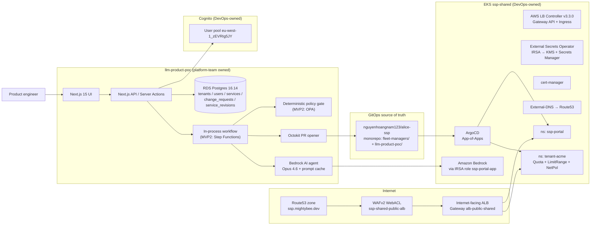
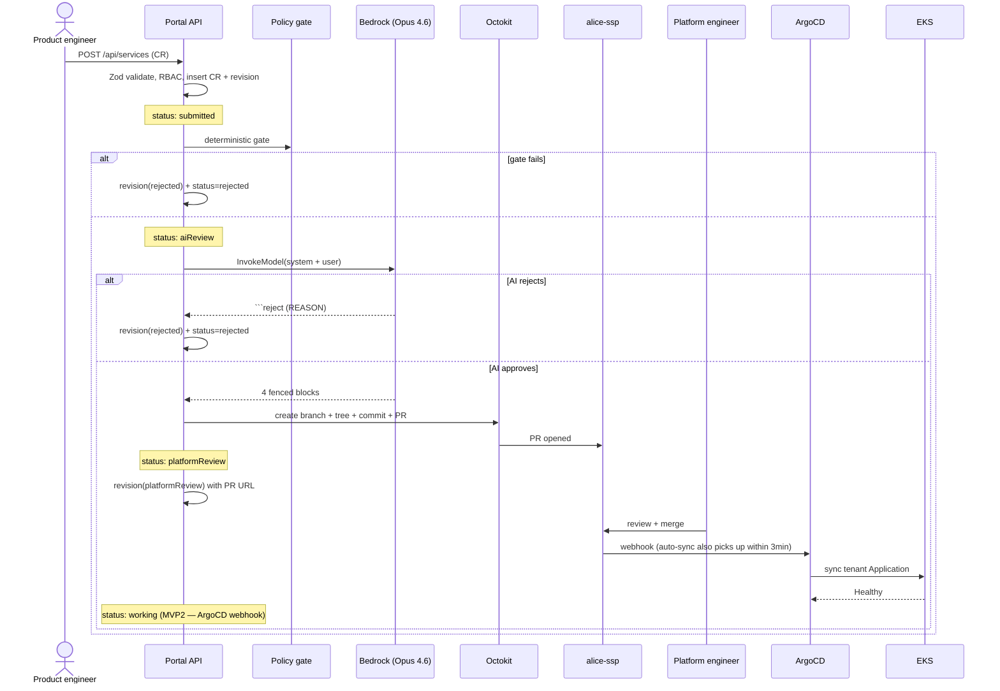
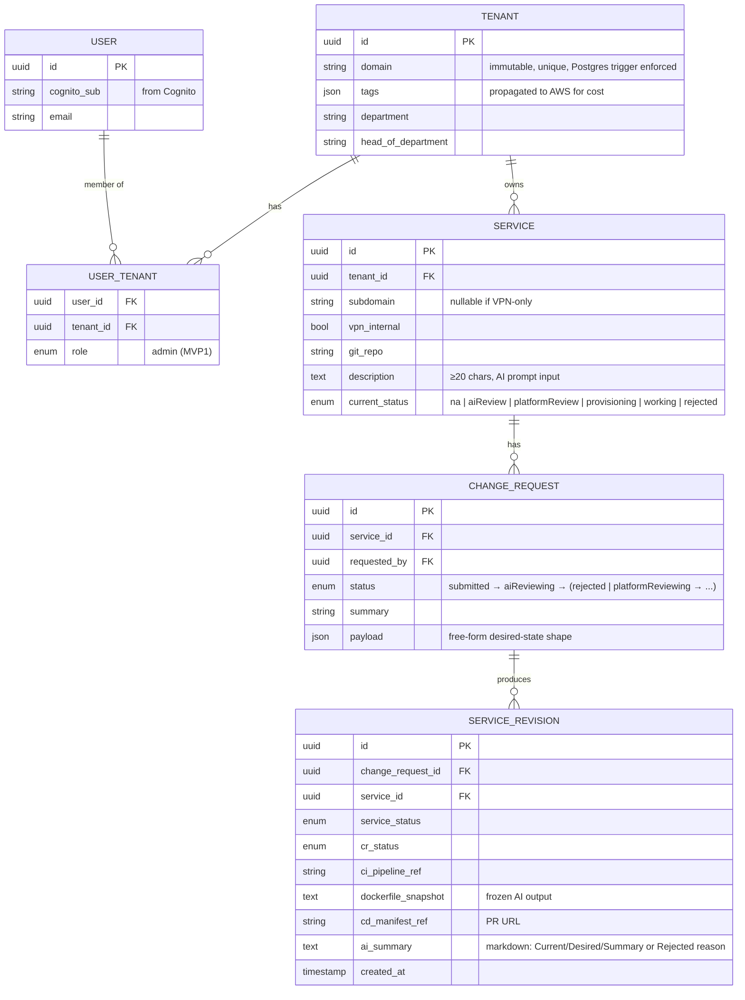
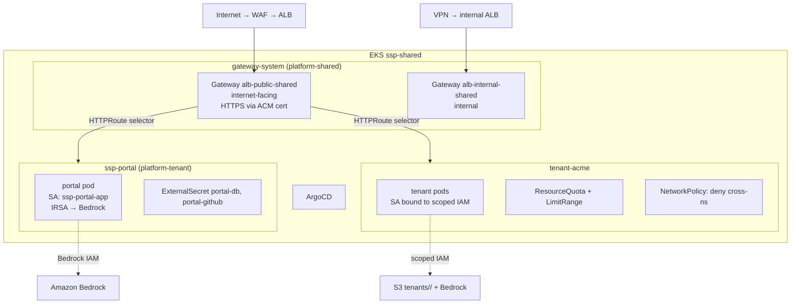

# Architecture

## System diagram

## Ownership boundaries

| Layer | Owner | Tooling |
| --- | --- | --- |
| AWS account, SCPs, IAM permission boundaries | Central DevOps | Terraform foundation layers |
| EKS cluster, VPC, ArgoCD install, Cognito pool, shared ALBs, Route53, KMS | DevOps | `fleet-managers/terraform/foundation/00-*..50-*` |
| GitOps repo + Helm chart + ApplicationSet + per-tenant Terraform modules | Platform team | `fleet-managers/terraform/modules/`, `fleet-managers/helm/app/`, `fleet-managers/argocd/` |
| Portal (Next.js app + AI agent + workflow + Octokit) | Platform team | `llm-product-poc/` |
| Tenant workloads + ChangeRequest payloads | Tenants | Submitted through the portal, reviewed by platform team |

The seam is deliberate: a tenant cannot edit Terraform, the platform team cannot edit
tenant application code, and DevOps cannot accidentally change a tenant's namespace
labels (because everything is in git and ArgoCD reconciles continuously).

## Authoritative workflow

## Data model

`SERVICE_REVISION` is append-only — the audit trail for who-asked-for-what-and-when.
`TENANT.domain` is enforced immutable by a Postgres `BEFORE UPDATE` trigger so
cost-allocation history doesn't break on a rename.

## EKS multi-tenancy boundary

A tenant can attach an `HTTPRoute` to a shared `Gateway` only when their namespace
carries the `ssp.platform/tenant` label, which only the Terraform `tenant-namespace`
module sets. The `NetworkPolicy` denies cross-namespace ingress by default. IRSA scopes
each tenant's pods to a per-tenant IAM role limited to `bedrock:InvokeModel` and the
tenant's S3 prefix.

## Foundation Terraform layers

| Layer | Purpose | Idle cost |
| --- | --- | --- |
| `00-bootstrap` | S3 + DynamoDB state backend + KMS CMK for secrets | <$1/mo |
| `10-vpc` | VPC, 3 AZs, 1 NAT (dev), tagged for ALB/EKS subnet auto-discovery | ~$32/mo |
| `15-dns` | Route53 zone `ssp.mightybee.dev` + ACM cert for portal | <$1/mo |
| `20-eks` | Cluster + 2× t3.medium + OIDC + EKS-native addons | ~$133/mo |
| `30-cognito` | User pool, app client, Hosted UI, platform-engineer group | free tier |
| `40-platform-addons` | LBC (Gateway API), Gateway API CRDs, External-DNS, cert-manager, ESO, metrics-server, two GatewayClasses + LBConfigs + shared Gateways | ~$32/mo (2 ALBs) |
| `45-waf` | WebACL: AWS managed rules + IP-rep + SQLi + rate-limit; CloudWatch logging | ~$5–15/mo |
| `50-argocd` | ArgoCD + App-of-Apps root | $0 (in-cluster) |
| `55-ecr` | ECR repo `ssp-portal` + GitHub Actions OIDC role | <$1/mo |
| `60-portal-data` | RDS Postgres + master creds in Secrets Manager (KMS-encrypted) | ~$15/mo |
| `70-portal-app` | Portal namespace + ExternalSecrets + portal IRSA role w/ Bedrock | $0 |
