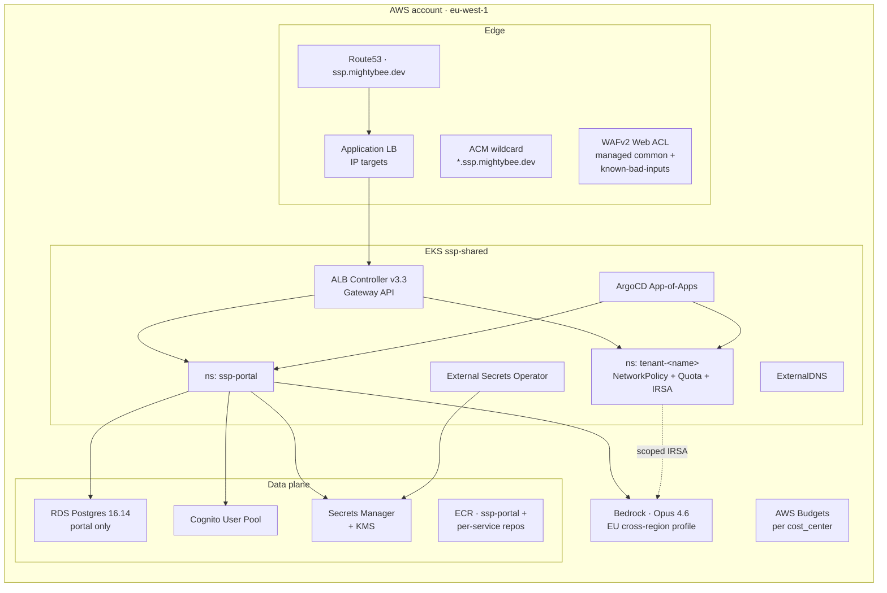
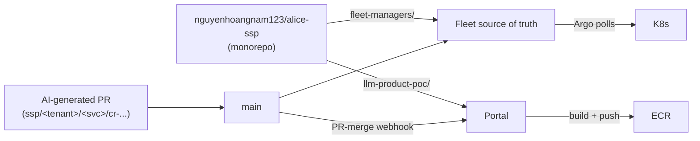
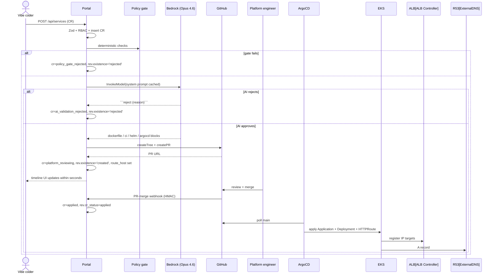

# Deliverable 1 — 01 · Target architecture & tenancy

## Persona this serves

A product engineer at Alice — analyst, PM, intel researcher, marketer — who can
prompt their way to a working prototype with Claude Code but **cannot, and should
not have to**, configure Kubernetes, write IAM policies, or wire up secrets.
They want one path from "it works on my laptop" to "live URL my team uses,"
faster than asking a platform engineer.

## End-to-end path

```mermaid
flowchart LR
  User((Vibe coder)) -->|describes the service<br/>in plain English| Portal
  Portal -->|policy gate<br/>+ Bedrock| Bedrock[Claude Opus 4.6<br/>via Bedrock]
  Bedrock -->|reject| Portal
  Bedrock -->|approve + 4 artifacts| GH[GitHub PR<br/>against fleet repo]
  GH -->|platform engineer<br/>reviews & merges| Main[main branch]
  Main -->|Argo polls 3min| ArgoCD
  ArgoCD --> K8s[EKS cluster<br/>tenant namespace]
  K8s --> ALB[Public ALB<br/>+ WAF + ACM wildcard]
  ALB -->|live URL| Team[Team uses it]
```



Approved CR → live URL is ~3 minutes wall-clock, of which ~12 s is the AI step
and the rest is GitHub Actions + ArgoCD reconcile. **The platform engineer is
the only human in the loop** — every other step is deterministic or AI-driven.

## AWS topology



### Terraform layers

```
fleet-managers/terraform/foundation/
  00-bootstrap   state backend (S3 + DDB) + KMS CMK for secrets
  10-vpc         VPC, 3 AZs, 1 NAT
  15-dns         Route53 zone + ACM wildcard
  20-eks         EKS cluster + managed node group, CW log retention 1d
  30-cognito     User pool + app client
  40-platform-addons   LBC v3.3, ESO, ExternalDNS, ArgoCD, Gateway API CRDs
  45-waf         Regional Web ACL + ALB association + 1d log retention
  50-argocd      App-of-Apps Application
  55-ecr         ECR repos + GitHub OIDC trust
  60-portal-data RDS Postgres + master creds secret
  70-portal-app  Portal namespace + IRSA + ExternalSecrets
  80-cost-governance AWS Budgets per cost_center + account overall
  tenants/<name>/   Per-tenant namespace, NetworkPolicy, ResourceQuota, IRSA
```

Numbered in apply order. Each layer has its own remote-state key.

## GitHub topology



Single repo, two top-level directories. Branch model: `main` is protected;
AI-generated branches are `ssp/<tenant>/<service>/cr-<short-id>` and auto-deleted
on merge. PR-merge webhook hits `/api/webhooks/github` (HMAC-signed) so the CR
flips to `applied` without waiting on Argo's poll.

## Tenancy and isolation

Five planes, each with its own shared/per-app split:

| Plane | Shared | Per-tenant | Per-app (within tenant) |
| --- | --- | --- | --- |
| **Compute** | EKS cluster, managed node group | Kubernetes namespace | Deployment / Service / HTTPRoute |
| **Data** | RDS instance for the portal only; tenants don't share this DB | (tenants bring their own data store; out of scope for MVP1) | — |
| **Secrets** | KMS CMK `alias/ssp-platform-secrets`, Secrets Manager service | Path prefix `ssp/<tenant>/*`; per-tenant `ExternalSecret` only sees its prefix | Per-service secret under `ssp/<tenant>/<service>/*` |
| **Network** | Public ALB + WAF + shared Gateway | NetworkPolicy denies cross-namespace ingress | HTTPRoute attaches to shared Gateway via namespace-label selector `ssp.platform/tenant=<name>` |
| **IAM** | EKS OIDC provider | IRSA / Pod Identity role `ssp-tenant-<name>-app` with `bedrock:InvokeModel` + the tenant's S3 prefix only | (per-app trust scoped to the K8s ServiceAccount) |

### Why this slicing

- **One cluster, many namespaces** — keeps the cost flat as tenants are added.
  Cross-tenant resource contention is bounded by ResourceQuota; cross-tenant
  traffic is bounded by NetworkPolicy.
- **Shared ALB, namespace-label-gated routes** — the public ALB has one cert and
  one Gateway. A tenant claims a hostname only if their namespace carries the
  `ssp.platform/tenant=<name>` label, which **only the Terraform tenant module
  sets**. A tenant cannot claim another tenant's hostname.
- **Per-tenant IRSA, never a shared role** — keeps the blast radius of a
  compromised pod inside one tenant's resources.
- **Postgres trigger pinning `tenants.domain` as immutable** — preserves
  cost-allocation history across renames. The trigger is a single function;
  cheapest possible enforcement.

## Authoritative workflow



The single source of truth for **what state did this service go through and
why** is the append-only `change_requests.status_history` JSONB array. Every
transition appends one row; the orchestrator never deletes. A platform engineer
debugging "why is acme/hello-world at this version?" runs one SQL query and gets
every step.

## Data model

```mermaid
erDiagram
    TENANT ||--o{ USER_TENANT : has
    USER ||--o{ USER_TENANT : member-of
    TENANT ||--o{ SERVICE : owns
    SERVICE ||--o{ CHANGE_REQUEST : has
    CHANGE_REQUEST ||--|| SERVICE_REVISION : "produces (1:1)"
    TENANT { string id PK; string domain; string cost_center; string department }
    SERVICE { string id PK; string name; string subdomain; string description; enum current_status }
    CHANGE_REQUEST { string id PK; enum status; jsonb status_history; jsonb payload }
    SERVICE_REVISION { string id PK; enum existence_status; enum health_status; string route_host; text ai_summary }
```

Two invariants enforced by indexes:
- **1 CR → 1 revision** — `unique(change_request_id)` on `service_revisions`.
  The orchestrator's `upsertRevision` is idempotent against re-runs.
- **Subdomain unique per tenant** — `unique(tenant_id, subdomain) where
  subdomain is not null`.

Revisions carry **two independent status dimensions**:
- `existence_status` (created / rejected / null-in-flight) — derived from the
  CR workflow outcome.
- `health_status` (healthy / unhealthy / unknown) — updated by the periodic
  readiness prober every 60 s. `service.current_status` mirrors the latest
  revision so list pages don't need a JOIN.
