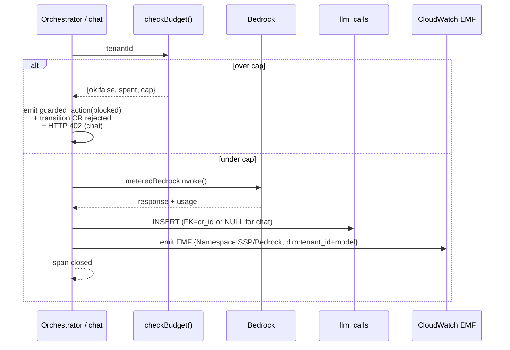
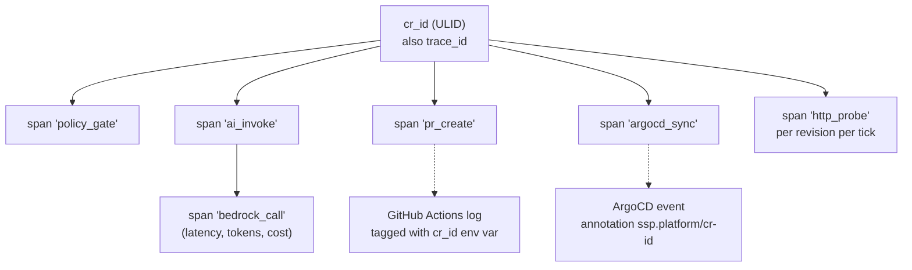

# Deliverable 1 — 02 · Observability & cost

The spec calls out two AI-specific observability needs by name: **LLM token
costs as a first-class signal** and **tracing across the agent / tool-call
chain**. Both are designed here. The reference implementation lives in
[`mcp-server/`](../mcp-server/).

## Tag schema — per-app / per-user attribution

Every AWS resource carries six keys, applied via Terraform `default_tags` on
every `aws` provider. Every Kubernetes object carries the same six as labels
via Helm `_helpers.tpl`.

| AWS tag | K8s label | Drives |
| --- | --- | --- |
| `tenant` | `ssp.platform/tenant` | Per-tenant chargeback |
| `product` | `ssp.platform/product` | Per-product cost (portal vs shared infra vs tenant workload) |
| `environment` | `ssp.platform/environment` | Multi-env when relevant |
| `cost_center` | `ssp.platform/cost-center` | Department chargeback — drives AWS Budget filters |
| `managed_by` | `app.kubernetes.io/managed-by` | IaC vs click-ops audit |
| `owner` | — | Escalation target |

### Three tenant identities

- `tenant=platform-shared` — VPC, NAT, EKS control plane, ALB, ArgoCD, KMS,
  WAF. *How much does running the platform cost regardless of tenancy?*
- `tenant=ssp-portal` — Cognito pool, RDS, the portal namespace, ECR for the
  portal image. *How much does the SSP product cost the platform team?*
- `tenant=<name>` — per-tenant workloads. *How much do we spend on alice's
  services this month?*

Cost Explorer's `Group by tenant over last 30 days` splits the bill into the
three buckets above. `Group by product` answers "platform vs portal."

### Compute attribution

EKS doesn't have an AWS tag for compute — it has K8s labels. Two paths:
1. **AWS Split Cost Allocation Data** (regional setting) — reads K8s labels and
   apportions the shared EKS bill by pod CPU/memory requests.
2. **OpenCost** (Ring 2) — same labels, emits Prometheus metrics for Grafana.

### Why `tenants.domain` is immutable

A Postgres `BEFORE UPDATE` trigger rejects updates. Reason: cost-allocation
history. Last month's `tenant=acme` must aggregate with this month's
`tenant=acme` in Cost Explorer; a rename would split the line. Cheapest
possible enforcement.

## Cost budgets

`foundation/80-cost-governance/` provisions one AWS Budget per cost-center plus
an account-overall budget. Each sends email alerts at 50 % / 80 % actual and
100 % forecasted. Live defaults:

| Budget | Cap | Filter |
| --- | --- | --- |
| `cc-platform-eng` | $80/mo | `user:cost_center=platform-eng` |
| `cc-alice` | $30/mo | `user:cost_center=alice` |
| `account-overall` | $150/mo | (none — catches untagged spend) |

Two **one-time activations** must be done by an account billing admin (can't
be Terraformed):
1. Billing → Cost Explorer → Enable
2. Billing → Cost Allocation Tags → activate `tenant`, `product`,
   `cost_center`, `environment`

Until #2, the per-cost-center budgets read $0.

### Idle cost ceiling

```
EKS control plane              $73/mo
1 NAT Gateway                  $32/mo   (single-NAT dev)
2 t3.medium nodes              $60/mo
RDS db.t4g.micro               $15/mo
3 ALBs (Gateway public/internal + Ingress) $48/mo
WAFv2 WebACL + rules           ~$10/mo
CloudWatch logs (1d retention) <$1/mo
Bedrock                        pay-per-token
Total idle                     ~$240/mo
```

Per CR: typical approval ≈ 600 input + 1200 output tokens on Opus 4.6 ≈
$0.02. Rejection ≈ 600 in + 60 out ≈ $0.005. Prompt caching on the system
prompt is the biggest lever — second invocation in a 5-min window pays ~0
input tokens for it.

## LLM token cost — first-class signal

### What we have today (live in this account)

- **`llm_calls` table** — every Bedrock invocation persisted with model id,
  input/output/cache tokens, computed USD cost, latency, optional
  change_request_id, tenant_id. Indexed on `(tenant_id, created_at)`.
- **`meteredBedrockInvoke()`** (`src/lib/observability/metered-invoke.ts`)
  — the only path the portal/orchestrator uses to call Bedrock. Wraps
  the call in: span open → invoke → parse usage → compute cost → INSERT
  → emit EMF event → span close. Atomic per call.
- **`checkBudget(tenantId)`** — same library, called BEFORE every Bedrock
  invoke. Reads `SUM(cost_usd) FROM llm_calls WHERE tenant_id=? AND
  created_at >= month_start` and compares to
  `tenants.bedrock_monthly_cap_usd` (default $5/mo, per-tenant
  overridable).
- **AWS Budget per `cost_center`** still in place as the second line of
  defence at the AWS-bill level (~24 h delay).
- **Live exercise**: the chat at `chat.ssp.mightybee.dev` is the
  end-to-end demo — sign in (Cognito), send messages (`meteredBedrockInvoke`
  on every send), watch the service-detail **usage widget** tick up.
  Hit the cap and `POST /api/chat/message` returns HTTP 402 with the
  spent/cap payload that the UI surfaces; Bedrock is never invoked.

### Gap (closes in Ring 2)

- Tenant-side calls via MCP record into `llm_calls` via the
  `/api/internal/llm-calls` HTTP endpoint, but **enforcement is
  trust-based** — a tenant app that bypasses MCP can call Bedrock with
  its own IRSA role without being metered. Ring 3 adds an in-cluster
  Bedrock egress proxy + NetworkPolicy to make this network-enforced.
- The budget check is best-effort: a concurrent burst of CRs from the
  same tenant can each pass the check and then push over cap. Ring 3
  rate-limits per call.

### How it works (live)



### Pieces

1. **`llm_calls` table** — append-only audit. Columns: `id`,
   `change_request_id` (nullable; chat passes null since trace IDs are
   synthetic), `tenant_id`, `model_id`, `input_tokens`, `output_tokens`,
   `cache_read_tokens`, `cache_write_tokens`, `cost_usd`, `latency_ms`,
   `created_at`.
2. **CloudWatch EMF metric publish** — every insert also emits
   `SSP/Bedrock/TokensInput`, `SSP/Bedrock/CostUSD` with dimensions
   `{tenant_id, model}`. Alarm on cost-rate (cents/min), not just total monthly.
3. **Budget guard** — `checkBudget()` is called from two places: the
   orchestrator (between `policy_gate_passed` and AI invoke) and the chat
   `/api/chat/message` route. Same function, single source of truth.
4. **Service-detail usage widget** —
   `src/components/usage-widget.tsx` renders on every service detail
   page. Shows spent / cap / remaining, a color-coded progress bar (green
   → blue → yellow → red as the percentage crosses 50/80/100), and the
   most-recent 8 MCP `record_llm_call` rows with model, tokens,
   cache-hit, cost, latency, CR linkage when present.

### Reference + tenant implementation

[`mcp-server/`](../mcp-server/) is a runnable MCP server with four tools.
The portal uses the same schema in-process (library mode) via
`src/lib/observability/`; tenant pods spawn the MCP server as a sidecar
(stdio mode).

| Tool | Purpose |
| --- | --- |
| `check_budget` | Pre-flight cost guardrail. Calls portal `GET /api/internal/budget/<tenantId>`; returns `{ok, spent_usd, cap_usd, remaining_usd}`. Tenant apps MUST honour `ok=false` by refusing to invoke Bedrock. |
| `record_llm_call` | One Bedrock invocation: model, tokens, computed USD, latency. Emits EMF on stderr + POSTs to portal `/api/internal/llm-calls` so the next `check_budget` reflects it. |
| `start_span` / `end_span` | Trace span open/close — see next section. |
| `log_guarded_action` | Audit log for sensitive ops (PII block, allowlist refusal, self-refusal-over-budget). |

Pricing table in `mcp-server/src/pricing.ts` is shared with
`llm-product-poc/src/lib/observability/pricing.ts` by convention
(same model IDs, same per-1M-token rates).

`npm run toy` exercises the orchestrator path end-to-end.  
`npm run tenant` exercises the tenant path (spawn MCP → `check_budget` →
simulate Bedrock → `record_llm_call`).

## Tracing across the agent / tool-call chain

### What we have today

One stdout log line per orchestrator phase. Grep-able in CloudWatch when
retention isn't 1 day. No trace ID across portal / Bedrock / GitHub /
ArgoCD / EKS.

### Gap

A CR that ends `applied` but misbehaves needs the engineer to correlate **five
log surfaces**: portal stdout, Bedrock CloudTrail, GHA log, ArgoCD reconcile,
EKS events. No shared join key.

### Design — one trace ID per CR

The CR ID **is** the trace ID. Every emit downstream attaches it.



Pieces:

1. **MCP `start_span` / `end_span`** — see `mcp-server/`. Spans land as JSON-L
   on stderr (CW EMF) and can fan out to an OTel collector via FluentBit.
2. **Propagation through GitHub** — AI-generated `build.yml` carries
   `env: SSP_CR_ID` from a repo variable; every workflow step echoes it on
   each log line.
3. **Propagation through ArgoCD** — AI prompt sets
   `Application.metadata.annotations["ssp.platform/cr-id"]`; cluster events
   inherit annotations.
4. **Probe results in trace** — `prober.ts::probeOne` opens a span per
   probe, tags with revision ID, closes with status.

### End-to-end trace, what it looks like

```
[T0]      policy_gate              cr=01K...   duration=28ms   ok
[T0+30ms] ai_invoke
[T0+30ms]   bedrock_call           model=opus   in=2843 out=812  cost=$0.018 latency=11.2s
[T11s]    pr_create                pr_number=14   latency=3.4s
[T15s]    cr_state=platform_reviewing
[T31m]    pr_merge_webhook         hmac_ok=true
[T31m]    cr_state=applied
[T34m]    argocd_sync              annotation:cr-id=01K... healthy=true
[T34m]    probe                    revision_id=...  status=200  health=healthy
```

One filter on `cr=01K…` returns the entire chain. Today: five separate queries
with no join key.

## Cluster & WAF observability

- **CloudWatch Container Insights** enabled by the EKS module — pod CPU/memory,
  node disk/io.
- **Metrics Server** in `kube-system` so HPA + `kubectl top` work.
- **WAF logs** → CW log group `aws-waf-logs-ssp-shared-public-alb`, 1-day
  retention. `Authorization` and `Cookie` headers redacted by
  `redacted_fields` so JWTs / session cookies never hit CW.
- **ArgoCD UI** — live mirror of the GitOps repo. Per-Application sync
  history visible via the API too.

## SLOs (proposed, not yet enforced)

| Indicator | Target | Burn alert |
| --- | --- | --- |
| Portal `/login` HTTP 200 | 99.5 % / 30d | 2× error budget / 6 h |
| Approved CR → PR opened | p95 < 30 s | p95 > 60 s / 1 h |
| AI false-approval rate on hard caps | 0 % weekly | any false approval = P1 |
| ArgoCD sync to Healthy | p95 < 5 min | p95 > 10 min / 30 min |
| Tenant ALB 5xx rate | < 1 % | > 5 % / 5 min |

The AI accuracy SLO is the interesting one — every approved CR that *should
have been rejected* is investigated as a prompt regression.

## What ships when

| Capability | Ring |
| --- | --- |
| AWS Budgets per cost-center + alerts | **Ring 1 (live)** |
| Six-key tag schema + immutable domain | **Ring 1 (live)** |
| MCP server with `check_budget` / `record_llm_call` / spans / `log_guarded_action` | **Ring 1 (live)** |
| `meteredBedrockInvoke()` wired into orchestrator + chat | **Ring 1 (live)** |
| `llm_calls` table + per-tenant `bedrock_monthly_cap_usd` + `checkBudget()` guard | **Ring 1 (live)** |
| Internal HTTP API for tenant-side MCP (`/api/internal/budget`, `/api/internal/llm-calls`) with shared bearer auth | **Ring 1 (live)** |
| Service-detail usage widget (cost, cap, recent calls) | **Ring 1 (live)** |
| Tracing propagation across GHA + ArgoCD | Ring 2 |
| OpenCost in-cluster + Grafana | Ring 2 |
| Prometheus + AlertManager rules per SLO | Ring 2 |
| Egress-proxy + NetworkPolicy that denies direct Bedrock from tenant ns (enforced vs trust-based) | Ring 3 |
| Per-tenant Bedrock rate limit (blocks before invoke) | Ring 3 |
