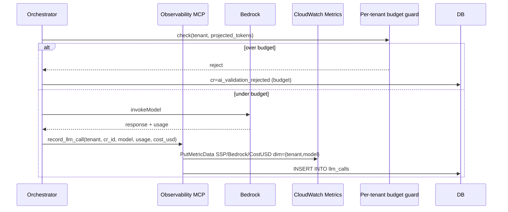
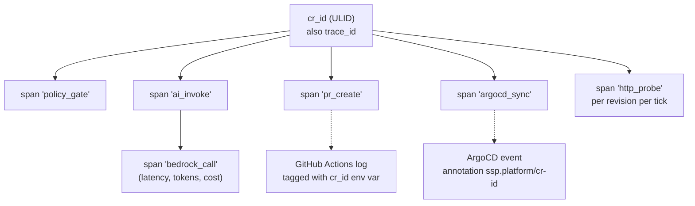

# Deliverable 1 — 02 · Observability & cost

The spec calls out two AI-specific observability needs by name: **LLM token
costs as a first-class signal** and **tracing across the agent / tool-call
chain**. Both are designed here. The reference implementation lives in
[`mcp-server/`](../mcp-server/).

## Tag schema — per-app / per-user attribution

Every AWS resource carries six keys, applied via Terraform `default_tags` on
every `aws` provider. Every Kubernetes object carries the same six as labels
via Helm `_helpers.tpl`.

| AWS tag | K8s label | Drives |
| --- | --- | --- |
| `tenant` | `ssp.platform/tenant` | Per-tenant chargeback |
| `product` | `ssp.platform/product` | Per-product cost (portal vs shared infra vs tenant workload) |
| `environment` | `ssp.platform/environment` | Multi-env when relevant |
| `cost_center` | `ssp.platform/cost-center` | Department chargeback — drives AWS Budget filters |
| `managed_by` | `app.kubernetes.io/managed-by` | IaC vs click-ops audit |
| `owner` | — | Escalation target |

### Three tenant identities

- `tenant=platform-shared` — VPC, NAT, EKS control plane, ALB, ArgoCD, KMS,
  WAF. *How much does running the platform cost regardless of tenancy?*
- `tenant=ssp-portal` — Cognito pool, RDS, the portal namespace, ECR for the
  portal image. *How much does the SSP product cost the platform team?*
- `tenant=<name>` — per-tenant workloads. *How much do we spend on alice's
  services this month?*

Cost Explorer's `Group by tenant over last 30 days` splits the bill into the
three buckets above. `Group by product` answers "platform vs portal."

### Compute attribution

EKS doesn't have an AWS tag for compute — it has K8s labels. Two paths:
1. **AWS Split Cost Allocation Data** (regional setting) — reads K8s labels and
   apportions the shared EKS bill by pod CPU/memory requests.
2. **OpenCost** (Ring 2) — same labels, emits Prometheus metrics for Grafana.

### Why `tenants.domain` is immutable

A Postgres `BEFORE UPDATE` trigger rejects updates. Reason: cost-allocation
history. Last month's `tenant=acme` must aggregate with this month's
`tenant=acme` in Cost Explorer; a rename would split the line. Cheapest
possible enforcement.

## Cost budgets

`foundation/80-cost-governance/` provisions one AWS Budget per cost-center plus
an account-overall budget. Each sends email alerts at 50 % / 80 % actual and
100 % forecasted. Live defaults:

| Budget | Cap | Filter |
| --- | --- | --- |
| `cc-platform-eng` | $80/mo | `user:cost_center=platform-eng` |
| `cc-alice` | $30/mo | `user:cost_center=alice` |
| `account-overall` | $150/mo | (none — catches untagged spend) |

Two **one-time activations** must be done by an account billing admin (can't
be Terraformed):
1. Billing → Cost Explorer → Enable
2. Billing → Cost Allocation Tags → activate `tenant`, `product`,
   `cost_center`, `environment`

Until #2, the per-cost-center budgets read $0.

### Idle cost ceiling

```
EKS control plane              $73/mo
1 NAT Gateway                  $32/mo   (single-NAT dev)
2 t3.medium nodes              $60/mo
RDS db.t4g.micro               $15/mo
3 ALBs (Gateway public/internal + Ingress) $48/mo
WAFv2 WebACL + rules           ~$10/mo
CloudWatch logs (1d retention) <$1/mo
Bedrock                        pay-per-token
Total idle                     ~$240/mo
```

Per CR: typical approval ≈ 600 input + 1200 output tokens on Opus 4.6 ≈
$0.02. Rejection ≈ 600 in + 60 out ≈ $0.005. Prompt caching on the system
prompt is the biggest lever — second invocation in a 5-min window pays ~0
input tokens for it.

## LLM token cost — first-class signal

### What we have today

- AWS Budget per `cost_center` catches Bedrock spend at the AWS-bill level,
  ~24 h delay.
- One stdout line per Bedrock call: `bedrock ok model=... ms=15078 tok_in=1136
  tok_out=1227 cache_read=0`. Grep-able, not query-able by tenant.

### Gap

- No per-CR token accounting.
- No per-tenant aggregation.
- No real-time alarm. A vibe coder's bug loop could fire 200 CRs in 5 minutes
  and blow through a daily budget before the alarm fires.

### Design



### Pieces

1. **`llm_calls` table** — append-only audit. Columns: `id`, `cr_id`,
   `tenant_id`, `model_id`, `input_tokens`, `output_tokens`,
   `cache_read_tokens`, `cache_write_tokens`, `cost_usd`, `latency_ms`,
   `created_at`.
2. **CloudWatch EMF metric publish** — every insert also emits
   `SSP/Bedrock/TokensInput`, `SSP/Bedrock/CostUSD` with dimensions
   `{tenant_id, model}`. Alarm on cost-rate (cents/min), not just total monthly.
3. **Budget guard** — before each Bedrock invoke, the orchestrator queries
   `SUM(cost_usd) WHERE tenant_id AND created_at > date_trunc('month', now())`
   and refuses if projected cost exceeds `tenants.bedrock_monthly_cap_usd`.
4. **Live dashboard line** — `/dashboard/tenants/<id>` shows current-month
   spend from `llm_calls` (sub-second freshness).

### Reference implementation

[`mcp-server/`](../mcp-server/) is a runnable MCP server with three tools:

| Tool | Purpose |
| --- | --- |
| `record_llm_call` | One Bedrock invocation: model, tokens, computed USD, latency. Emits EMF on stderr; downstream is CW Embedded Metric Format. |
| `start_span` / `end_span` | Trace span open/close — see next section. |
| `log_guarded_action` | Audit log for sensitive ops (PII block, allowlist refusal, prompt-injection detect). |

Pricing table in `mcp-server/src/pricing.ts` is static (Opus / Sonnet / Haiku
4.x rates from the public Bedrock page); we'd pull from the AWS pricing API
only if rates started moving more than once a quarter.

`npm run toy` runs end-to-end and prints four real EMF events on stderr.

## Tracing across the agent / tool-call chain

### What we have today

One stdout log line per orchestrator phase. Grep-able in CloudWatch when
retention isn't 1 day. No trace ID across portal / Bedrock / GitHub /
ArgoCD / EKS.

### Gap

A CR that ends `applied` but misbehaves needs the engineer to correlate **five
log surfaces**: portal stdout, Bedrock CloudTrail, GHA log, ArgoCD reconcile,
EKS events. No shared join key.

### Design — one trace ID per CR

The CR ID **is** the trace ID. Every emit downstream attaches it.



Pieces:

1. **MCP `start_span` / `end_span`** — see `mcp-server/`. Spans land as JSON-L
   on stderr (CW EMF) and can fan out to an OTel collector via FluentBit.
2. **Propagation through GitHub** — AI-generated `build.yml` carries
   `env: SSP_CR_ID` from a repo variable; every workflow step echoes it on
   each log line.
3. **Propagation through ArgoCD** — AI prompt sets
   `Application.metadata.annotations["ssp.platform/cr-id"]`; cluster events
   inherit annotations.
4. **Probe results in trace** — `prober.ts::probeOne` opens a span per
   probe, tags with revision ID, closes with status.

### End-to-end trace, what it looks like

```
[T0]      policy_gate              cr=01K...   duration=28ms   ok
[T0+30ms] ai_invoke
[T0+30ms]   bedrock_call           model=opus   in=2843 out=812  cost=$0.018 latency=11.2s
[T11s]    pr_create                pr_number=14   latency=3.4s
[T15s]    cr_state=platform_reviewing
[T31m]    pr_merge_webhook         hmac_ok=true
[T31m]    cr_state=applied
[T34m]    argocd_sync              annotation:cr-id=01K... healthy=true
[T34m]    probe                    revision_id=...  status=200  health=healthy
```

One filter on `cr=01K…` returns the entire chain. Today: five separate queries
with no join key.

## Cluster & WAF observability

- **CloudWatch Container Insights** enabled by the EKS module — pod CPU/memory,
  node disk/io.
- **Metrics Server** in `kube-system` so HPA + `kubectl top` work.
- **WAF logs** → CW log group `aws-waf-logs-ssp-shared-public-alb`, 1-day
  retention. `Authorization` and `Cookie` headers redacted by
  `redacted_fields` so JWTs / session cookies never hit CW.
- **ArgoCD UI** — live mirror of the GitOps repo. Per-Application sync
  history visible via the API too.

## SLOs (proposed, not yet enforced)

| Indicator | Target | Burn alert |
| --- | --- | --- |
| Portal `/login` HTTP 200 | 99.5 % / 30d | 2× error budget / 6 h |
| Approved CR → PR opened | p95 < 30 s | p95 > 60 s / 1 h |
| AI false-approval rate on hard caps | 0 % weekly | any false approval = P1 |
| ArgoCD sync to Healthy | p95 < 5 min | p95 > 10 min / 30 min |
| Tenant ALB 5xx rate | < 1 % | > 5 % / 5 min |

The AI accuracy SLO is the interesting one — every approved CR that *should
have been rejected* is investigated as a prompt regression.

## What ships when

| Capability | Ring |
| --- | --- |
| AWS Budgets per cost-center + alerts | **Ring 1 (live)** |
| Six-key tag schema + immutable domain | **Ring 1 (live)** |
| MCP server reference impl | **Ring 1 (live)** in `mcp-server/` |
| Wire MCP into orchestrator (`meteredInvoke`) | Ring 2 |
| `llm_calls` table + per-tenant budget guard | Ring 2 |
| Tracing propagation across GHA + ArgoCD | Ring 2 |
| OpenCost in-cluster + Grafana | Ring 2 |
| Prometheus + AlertManager rules per SLO | Ring 2 |
| Per-tenant Bedrock rate limit (blocks before invoke) | Ring 3 |
