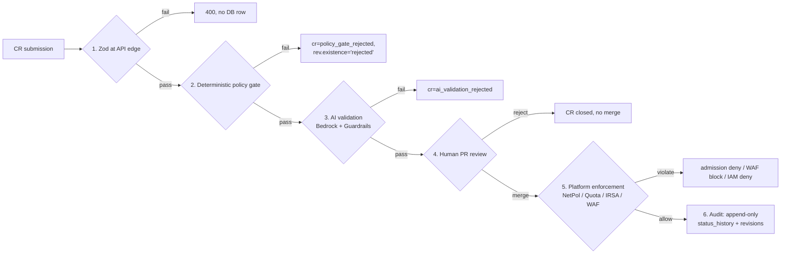
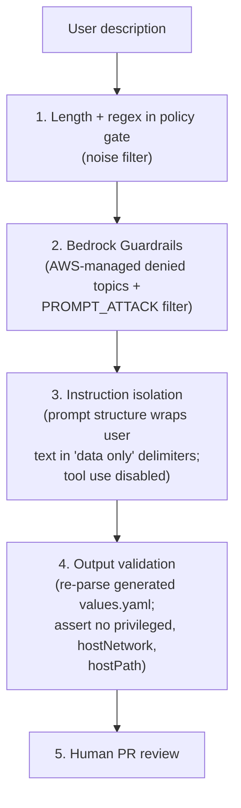
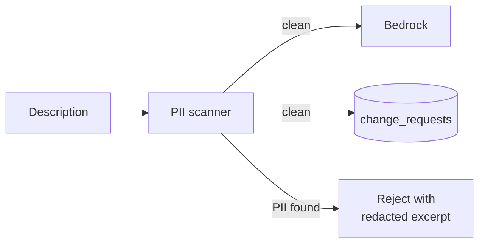

# Deliverable 1 — 03 · Guardrails

Six independent defences. A bad ChangeRequest has to defeat every one to cause
damage. Plus two AI-specific layers — prompt-injection defense and PII
handling — that the spec calls out by name.



## Layer 1 — Zod at the API edge

`src/app/api/services/route.ts` validates before any DB write:

```ts
const createServiceSchema = z.object({
  tenant_id: z.string().min(1),
  name: z.string().min(1).regex(/^[a-z0-9-]+$/),
  subdomain: z.string().regex(/^[a-z0-9-]*$/).optional().nullable(),
  vpn_internal: z.boolean().default(true),
  git_repo: z.string().url(),
  description: z.string().min(20),
});
```

No row, no workflow, no tokens spent on garbage.

## Layer 2 — Deterministic policy gate

`src/lib/policy/gate.ts` — runs after Zod, before Bedrock:

- Description ≥ 20 chars.
- `git_repo` is `https://`.
- Subdomain matches `^[a-z0-9-]+$` **OR** `^[a-z0-9-]+\.ssp\.mightybee\.dev$`
  — **single-label or 1-level FQDN only**. Two-level subdomains rejected
  because the wildcard `*.ssp.mightybee.dev` cert covers only one level.
- Subdomain unique within tenant (Postgres unique index).
- Tenant not soft-deleted.

Gate failures write `cr=policy_gate_rejected`, `rev.existence='rejected'`.
**Bedrock is never called** — zero AI cost on bad CRs. MVP2 swaps this for a
Rego bundle in `fleet-managers/policies/` evaluated by Conftest — same logic,
versioned alongside cluster manifests.

## Layer 3 — AI validation (Bedrock Opus 4.6)

`src/lib/ai/prompts.ts` ships a strict system prompt with hard caps. The
model is asked to **reject** (not silently clamp) on violation. The decision
is a single fenced output:

```
```reject
REASON: <one sentence>
```
```

`agent.ts` short-circuits on the `reject` fence; no PR opens.

### What the prompt forces the model to reject

| Rule | Cap |
| --- | --- |
| CPU per pod | ≤ 4 cores |
| Memory per pod | ≤ 8 GiB |
| Replicas | ≤ 20 |
| Image source | tenant ECR · `docker.io/library` · `gcr.io/distroless` · `public.ecr.aws/*` · `ghcr.io` |
| `privileged: true`, `hostNetwork`, `hostPath`, `hostPID` | reject |
| Override of namespace `NetworkPolicy` / `ResourceQuota` | reject |

### Live receipts

| CR | Status | AI reason |
| --- | --- | --- |
| 16 CPU per pod | rejected | "Requested 16 CPU per pod exceeds the 4-core cap." |
| 50 replicas | rejected | "Requested replicaCount of 50 exceeds the 20-replica cap." |
| Untrusted registry | rejected | "Image source \"ealen/echo-server\" is not from the tenant's ECR or a well-known upstream." |
| Privileged + hostNetwork | rejected | "Description explicitly requests a privileged container with hostNetwork enabled, which violates platform security policy." |

### Prompt-injection defence — five layers

The `description` field is **user input that goes straight into Bedrock's user
message**. Layered defences:



| Layer | Status | Why this works |
| --- | --- | --- |
| 1 — regex on description | Ring 1 extension to existing gate | Free, sub-ms; kills the obvious "ignore previous instructions" pattern before paying Bedrock. |
| 2 — Bedrock Guardrails | Ring 2 (1 Terraform resource + invoke param) | Server-side denied topics + PROMPT_ATTACK + PII filters. |
| 3 — Instruction isolation | Ring 2 | Wrap user text in `<description>...</description>`, tell the model to treat as data, **disable tool use** on the artifact call. Constitutional pattern: repeat platform rules at end of user message. |
| 4 — Output validation | **Ring 1 (2 h work)** | Even if injection talks the AI into anything, the generated YAML still has to pass our deterministic parser asserting no `privileged:true`, no `hostNetwork`, no `hostPath`. Closes the loop. |
| 5 — Human PR review | Ring 1 (live) | Final gate; reviewer sees the AI's reasoning attached to the diff. |

### Prompt caching

System prompt (~1 KB) is identical across every CR. We send with
`cache_control: ephemeral` so Bedrock reuses it across the 5-min window — second
call in window pays ~0 input tokens. Live receipts:

```
bedrock ok model=...opus-4-6 ms=14210 tok_in=612  tok_out=1017 cache_read=0
bedrock ok model=...opus-4-6 ms=1879  tok_in=1143 tok_out=61   cache_read=0   ← reject path
bedrock ok model=...opus-4-6 ms=15078 tok_in=1136 tok_out=1227 cache_read=0
```

Rejection path is ~12× faster than approval (1.9 s vs 15 s) — short reject
fence vs. four code blocks.

## PII handling

### Today

Nothing specific. PII in a CR description flows untouched to Bedrock and into
`change_requests.summary`.

### Design



### Scanner stack — three layers

| Layer | Mechanism | Best for |
| --- | --- | --- |
| **A — Regex pre-filter in policy gate** | Free, sub-ms; catches the obvious — email, IP address, AWS access key (`AKIA[0-9A-Z]{16}`), JWT, credit card, SSN, AWS account ID. | Triage; reject before paying Comprehend. |
| **B — AWS Comprehend `DetectPiiEntities`** | Managed; covers EMAIL, ADDRESS, PHONE, NAME, CREDIT_DEBIT, etc. ~$0.0001 / 100 chars, ~200 ms. | Authoritative scan, only if A passes. |
| **C — Bedrock Guardrails PII filter** | Server-side, no extra hop. AWS-maintained entity list. | Defence-in-depth on the AI call itself, after A + B. |

Recommended layering: A for triage (free, kills obvious), B for authoritative,
C as belt-and-braces on the Bedrock invoke.

### Storage policy

On detection: `cr.status='policy_gate_rejected'`, `status_history[].detail`
contains a redacted version (entity types listed, content asterisked:
`"contained: EMAIL ********@*****.com"`). **The raw description never lands
in the DB.** We don't store PII even in rejected rows — the audit value is
"they tried", not "what they tried with."

### Audit hook

Every PII rejection emits an event via MCP `log_guarded_action`
([`mcp-server/`](../mcp-server/)). Append-only, KMS-encrypted, reviewed weekly
by the security team.

## Layer 4 — Human pull-request review

The portal does not write to Kubernetes or AWS at runtime. The only thing it
writes is git, via `octokit/rest` against `nguyenhoangnam123/alice-ssp`. Each
approved CR opens a PR with four files (Dockerfile, build.yml, values.yaml,
ArgoCD Application).

`CODEOWNERS` requires platform-team approval. Until merge, ArgoCD sees nothing
new. This is the **last fully synchronous guardrail** — beyond, the loop is
async (ArgoCD reconciles continuously).

The reviewer sees:
- Exactly which four files will change.
- The AI's `Current state` → `Desired state` rationale in the PR body.
- The diff is the proposal — no out-of-band side effects.

## Layer 5 — Platform enforcement

After merge, ArgoCD reconciles into the tenant namespace. Even if the AI and
the engineer collectively missed something, runtime defences kick in.

### NetworkPolicy

`foundation/tenants/<name>/` provisions a default-deny NetworkPolicy. Only
ingress from the namespace itself plus a configurable allowlist (Gateway
namespace, argocd) is admitted. A tenant pod **cannot** reach another
tenant's pod regardless of what the workload claims.

### ResourceQuota + LimitRange

Same module: per-namespace quota (defaults 4 CPU / 8 GiB / 20 pods) + LimitRange
default per-container. A manifest asking for more is rejected by the K8s
admission controller — even if the AI somehow generated it.

### IRSA / Pod Identity

Per-tenant role with two scoped policies:
- `bedrock:InvokeModel` on a small set of Anthropic models.
- (Optional) S3 on `tenants/<id>/*` prefix only.

Trust policy locks the role to a specific ServiceAccount in the tenant's
namespace via cluster OIDC. **A pod in tenant A literally cannot assume
tenant B's role.**

### WAF on the public ALB

`foundation/45-waf/` regional WAFv2 Web ACL:
- `AWSManagedRulesCommonRuleSet` (OWASP)
- `AWSManagedRulesKnownBadInputsRuleSet`
- `AWSManagedRulesAmazonIpReputationList`
- `AWSManagedRulesSQLiRuleSet`
- Custom rate-limit-per-IP: 2000 / rolling 5 min → 429
- Narrow allows for `/api/webhooks/*` and argocd hostname (priority 1)

`Authorization` + `Cookie` headers redacted from CW logs.

### TLS + ALB scheme

ACM cert issued in the same Terraform run as the Route53 zone, validated via
DNS in the same hosted zone — issuance never needs a manual step.
Gateway `LoadBalancerConfiguration` sets `scheme: internet-facing` for public
or `scheme: internal` for VPN. There's no path for an internal service to
accidentally become internet-facing — the GatewayClass is chosen by the
tenant's `vpnInternal` value; the ALB scheme is set at the GatewayClass level
by the platform.

### Cognito

`allow_admin_create_user_only = true`. No self-signup. New employees invited
by the platform team. Password policy 12 chars + mixed + digit + symbol.

## Layer 6 — Audit trail

Every state transition appends to `change_requests.status_history` JSONB as
`{status, at, detail?}`. Orchestrator never deletes — only appends. Every
revision row carries the verbatim AI summary, frozen Dockerfile snapshot, PR
URL. Future engineer debugging "why this version?" reads the prompt the AI
saw and the response it gave.

The portal UI surfaces this as an expandable timeline on each service detail
page — workflow steps with timestamps, AI summary, route host, last probe
time. Rejected revisions stay in the timeline forever as audit evidence —
"we tried to ship X, the platform refused, here's why."

## Honest gaps (Ring 2+ work)

- **Mock data path** — when `AI_MODE=mock` (used in CI), validation is bypassed
  because the deterministic template always approves. CI would need to exercise
  the policy gate directly.
- **Human is human** — a tired engineer can merge a bad PR if the AI is
  convincing. Runtime defences (L5) are the safety net.
- **No image scanning** — AI is told to use trusted registries; we don't verify
  at admission time. Ring 3 adds a Cosign / sigstore policy via Kyverno.
- **No secret rotation cadence** on the portal's GitHub PAT or webhook secret.
  See [deliverable1-04-lifecycle-and-ownership.md](./deliverable1-04-lifecycle-and-ownership.md) for the plan.
- **No per-tenant Bedrock rate-limit** — see [deliverable1-02-observability-and-cost.md](./deliverable1-02-observability-and-cost.md)
  on the budget-guard design.
