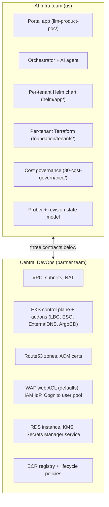
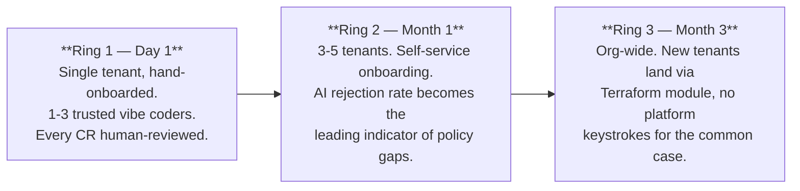

# Deliverable 1 — 04 · Lifecycle & ownership

Provisioning, updates, secret rotation, retirement — plus the explicit boundary
between the AI Infra team and central DevOps.

## Lifecycle

```mermaid
flowchart LR
  P[Provisioning<br/>= new CR] --> U[Updates<br/>= new CR on existing service]
  U --> R[Retirement<br/>= decommission CR]
  P -.-> SR[Secret rotation<br/>(continuous, infra-side)]
  U -.-> SR
```

### Provisioning

A vibe coder submits a CR via the portal. The full path is in
[deliverable1-01-architecture.md](./deliverable1-01-architecture.md#authoritative-workflow).

Time budget on the happy path:
- Zod + RBAC + policy gate: ~30 ms.
- Bedrock invoke (~12 s, with prompt caching).
- PR creation via Octokit: ~4 s.
- Platform engineer review: O(minutes) human.
- ArgoCD poll + apply: 3–5 min.

**Total: ~3 min wall-clock + the human gate.**

### Updates

Every change to an existing service is a new CR against the same service ID.
The 1:1 invariant — `service_revisions(change_request_id)` unique — means each
CR produces exactly one revision. The latest revision drives
`service.currentStatus`; older revisions are frozen historical snapshots.

The orchestrator generates a diff against current state, not a fresh repo.
ArgoCD Application name is deterministic (`<tenant>-<service>`, pinned in the
AI prompt) so two CRs against the same service **update the same Application
in place** — there's no orphaning. The Application also has the
`resources-finalizer.argocd.argoproj.io` finalizer so a delete cascades to
children.

### Secret rotation

Today: GitHub PAT, webhook HMAC secret, RDS master credentials all live in
Secrets Manager. Static — once provisioned they live forever.

Plan:
1. **RDS master** — AWS Secrets Manager has built-in RDS rotation. Enable on
   the existing secret with a 30-day cadence; Secrets Manager talks to RDS
   directly, no Lambda needed.
2. **GitHub PAT** — fine-grained PAT scoped to `nguyenhoangnam123/alice-ssp`,
   `repo:contents:write` + `pull_requests:write` only. Rotation via Lambda
   that calls GitHub's PAT-rotation API monthly; the new value is written to
   Secrets Manager, ESO syncs it into the cluster within `refreshInterval`
   (1 h).
3. **Webhook HMAC** — symmetric secret, rotated by a Lambda that updates both
   sides (writes new value to Secrets Manager **and** GitHub's webhook
   config). Quarterly cadence; the app accepts the old value for an overlap
   window during rotation.

All three are Ring 2 work. Today the secrets are KMS-encrypted at rest; the
gap is **cadence**, not strength.

### Retirement

Today: no documented decommission path. To remove a service, a platform
engineer manually deletes the ArgoCD Application (finalizer cascades K8s
resources) and tombstones the DB row.

Plan: a **decommission CR** that:
1. Sets `services.deletedAt = now()`.
2. Generates a PR deleting the `tenants/<>/apps/<>/` directory and the
   matching `argocd/apps/<>-<>.yaml`.
3. On merge: ArgoCD's finalizer prunes Deployment / Service / HTTPRoute. ESO
   refreshes; the secret reference is gone so the secret stays in Secrets
   Manager but unmounted (revoke later via cleanup CR).
4. ExternalDNS deletes the A record on HTTPRoute removal.
5. IRSA role removed by terraforming away the tenant-app's policy attachment.

Ring 3 — straightforward but requires UI + Octokit support. The portal's
service detail page would gain a "Decommission" button that opens a CR with a
canned payload.

## Ownership boundary

Two teams. One platform. Clean seam.



### Ownership table

| Concern | Owner | Why |
| --- | --- | --- |
| VPC / subnets / NAT | DevOps | Shared by every workload. Lifetime measured in years. |
| EKS control plane + managed addons | DevOps | Cluster-wide; rotation cadence dictated by EKS LTS. |
| Route53 zones + ACM certs | DevOps | Account-scope DNS / cert plane. |
| WAF Web ACL defaults | DevOps; **portal-specific allow rules (`/api/webhooks/*`, argocd hostname)** = AI Infra | Defaults are platform; app-specific overrides are ours. |
| Per-tenant Helm chart (`helm/app/`) | AI Infra | This *is* the product. Every CR-generated values.yaml consumes it. |
| Per-tenant Terraform module | AI Infra | Tenant isolation is a contract we sign with users. |
| Cost-governance Terraform | AI Infra | Defines per-cost-center budgets; we know who our tenants are. |
| AI prompt + policy gate | AI Infra | Single biggest lever on quality and safety. DevOps shouldn't have an opinion. |
| Portal app | AI Infra | Source of every CR. |
| ECR registry + lifecycle | DevOps | Account-scope; we get write via OIDC trust. |
| RDS portal database | DevOps instance; AI Infra schema | They operate Postgres; we model the workflow. |
| Cognito user pool | DevOps pool; AI Infra `user_tenants` model | They run the IdP; we decide who admins what. |
| Bedrock access + invocation IAM | AI Infra | We pay for tokens; we shape prompts. |
| Image scanning / signing (Ring 3) | Joint — controller = DevOps, policy = AI Infra | Controller is platform; what counts as "signed" is app policy. |

### Three interface contracts

**Contract 1 — Network ingress.**
DevOps provides: public ALB at a stable hostname, ACM wildcard `*.ssp.mightybee.dev`
attached to 443, LBC v3.3+ with `ALBGatewayAPI` feature gate.
AI Infra consumes by labelling tenant namespaces `ssp.platform/tenant=<name>`
so the shared Gateway's `allowedRoutes` selector admits their HTTPRoutes.
Breaks if DevOps disables the feature gate or rotates the cert ARN without
notice.

**Contract 2 — Per-tenant IAM seed.**
DevOps provides: EKS cluster with OIDC issuer URL in remote state; Pod
Identity agent installed.
AI Infra consumes: per-tenant module attaches a role via Pod Identity
Association, scoped to the `ssp-tenant-<name>-*` prefix. We never modify
DevOps-owned roles.
Breaks if OIDC URL changes (cluster recreated) or the prefix collides.

**Contract 3 — Secret plane.**
DevOps provides: Secrets Manager + KMS key `alias/ssp-platform-secrets`, ESO
running cluster-wide with `ClusterSecretStore aws-secretsmanager`.
AI Infra consumes: tenant-app secrets under `ssp/<tenant>/<service>/*`,
portal-side under `ssp/portal/*`. We only publish `ExternalSecret` resources;
never write the cluster store directly.
Breaks if KMS key rotates to a new alias without re-encryption or the store
name changes.

### Three concrete scenarios

| Scenario | AI Infra does | DevOps does |
| --- | --- | --- |
| "New tenant" | Writes `foundation/tenants/<name>/`; `terraform apply`. Owns the result. | Nothing. The module uses only existing DevOps contracts. |
| "Upgrade EKS to 1.31" | Reviews if any addon contracts changed; adapts the Helm chart if yes. | Owns the upgrade itself. Pages us if a tenant app breaks. |
| "AI generates bad YAML" | 100% ours. Fix is prompt / allowlist / examples. | Not in the loop. |

### Why this seam, not a different one

We considered "DevOps owns Terraform, AI Infra owns the app." Rejected:

- **Tenants need Terraform.** Per-tenant IAM, ResourceQuota, NetworkPolicy
  are Terraform. If AI Infra can't write Terraform, every new tenant becomes
  a DevOps ticket.
- **DevOps shouldn't review prompt changes.** The AI prompt is a product
  surface; central DevOps has no signal on whether a change makes the platform
  better.
- **Coordination cost.** The current seam means AI Infra can ship from CR to
  live URL without a DevOps handoff in the common case. That's the spec's
  whole promise.

The seam follows **resource lifetime**: years (VPC, EKS, cert) → DevOps. Hours
to weeks (tenant, service, prompt) → AI Infra.

## Rollout shape — three rings



### Ring 1 — what ships first (live today)

- One tenant (`alice`) with namespace + NetworkPolicy + ResourceQuota + IRSA.
- CR workflow end-to-end: submit → policy gate (incl. injection +
  PII scanners) → **budget guard** → AI (with `<tenant_input>` isolation) →
  **output YAML re-validation** → PR → merge → reconcile.
- Wildcard `*.ssp.mightybee.dev` cert via ACM; ExternalDNS publishes A
  records.
- AWS Budgets per cost-center with email alerts.
- Per-tenant Bedrock cost guardrail: `tenants.bedrock_monthly_cap_usd` +
  `checkBudget()`. Refuses **before** any tokens are spent.
- MCP observability slice: spans, `record_llm_call`, `check_budget`,
  `log_guarded_action` — used in library mode by the portal and stdio
  mode by tenant apps.
- Prompt-injection defences (layers 1, 3, 4): regex scanner on
  description, `<tenant_input>` isolation in the AI prompt, deterministic
  re-parse of the generated `values.yaml` + `argocd.yaml` before PR open.
- PII regex pre-filter on description (layer A): email, IPv4, AWS access
  key, JWT, US SSN, credit card (Luhn-validated). Redacted in audit log.
- **Chat service** at `chat.ssp.mightybee.dev` — Cognito-gated, every
  message routes through `meteredBedrockInvoke`; live demo of the
  cost guardrail.
- **CR-mediated secret management** — `payload.kind=secret` CRs stage
  the value in an AWS Secrets Manager pending path, bypass the AI
  entirely, await admin approval on the CR detail page. Same review
  rails as every other change.
- **Unified Request-changes modal** — single entry point for every
  tenant-proposed change. Three vertical sections (static configs,
  non-sensitive env vars, sensitive secrets); one submit creates the
  appropriate mix of AI-routed + secret CRs.
- **Tabbed service detail page** — Versions / AI settings / MCP audit
  logs. The audit tab merges `llm_calls` + persisted
  `guarded_actions` events, ordered by time.
- **Desired-spec shadow column** (`services.desired_spec`) — populated
  on every CR → applied; rendered on AI settings tab. Foundation for
  the Ring-3 controller flip.
- Service-detail usage widget — per-tenant Bedrock spend, cap, recent
  MCP-recorded calls.
- Audit trail — `status_history` JSONB on every CR; `guarded_actions`
  table persists every policy/budget/AI/PII/injection rejection +
  secret-CR step.

### What stays manual at launch

- **New tenant onboarding.** Platform engineer runs
  `terraform apply -target=module.tenant_<name>` + adds the user to
  `user_tenants`. Automating this is Ring 2's first job — once we see the
  patterns the manual flow reveals.
- **Quota tuning.** Defaults (4 CPU / 8 Gi / 20 pods). Override via JIRA /
  Slack. Don't generalize until ≥3 tenants push on it.
- **PR review.** Every CR's PR is reviewed by a human. No auto-merge for any
  bucket, no matter how trivial.

### What unlocks the next 10x

Ranked by signal (LLM observability + budget guard already shipped in Ring
1):

1. **Self-service tenant onboarding** — a "new tenant" CR opens a PR that
   creates the tenant's Terraform module. Platform team reviews same as a
   service CR.
2. **Step Functions orchestrator** — replace in-process. Buys durability,
   retries, visualizable graphs. Unblocks portal HA.
3. **Auto-merge for low-risk CRs** — replica change 1-4 + no image change +
   AI confidence above threshold → auto-merge after a 5-min cool-off. Drops
   human-gate latency from O(hours) to O(minutes).
4. **PII scanning on CR descriptions** — [deliverable1-03](./deliverable1-03-guardrails.md).
5. **Tracing propagation through GHA + ArgoCD** — CR ID currently joins
   only the portal spans; extend to GHA `SSP_CR_ID` env var + ArgoCD
   `metadata.annotations["ssp.platform/cr-id"]`.
6. **Cost view in the portal** — `/dashboard/costs` page queries Cost
   Explorer via IRSA, shows 30-day spend per tenant alongside the
   per-service widget that already exists.
7. **Per-tenant JWT for MCP API** — replaces today's shared-secret bearer
   on `/api/internal/*` with short-lived per-tenant tokens.

### What's required to stay usable from 5 → 50 apps (Ring 3)

1. **Desired-state controller flip.** Today `services.desired_spec` is a
   shadow column populated on each CR → applied; git is authoritative for
   the cluster materialization. Ring 3 makes the DB authoritative: a
   deterministic renderer reads `desired_spec` and emits git artifacts;
   ArgoCD reconciles as before; a drift watcher polls ArgoCD + the cluster
   and surfaces `desired_spec ≠ observed` on the service detail page. This
   closes three gaps observed during this build:
   - platform-served services (chat) can be declared as CRs without
     producing a fleet PR (their `desired_spec` differs from a normal
     tenant deployment but is still the SSP's authoritative record).
   - **Decommission** becomes a CR that clears `desired_spec`; renderer
     emits a PR that deletes the fleet files.
   - **Drift detection** falls out for free — any out-of-band git or
     kubectl edit shows up as `observed_state ≠ desired_spec`.
   See [deliverable1-01 § "Desired-state controller (target architecture)"](./deliverable1-01-architecture.md#desired-state-controller-target-architecture).
2. HA portal + HA prober (single-replica today is fine for one tenant; not
   for fifty).
2. Image scanning + signature verification (Cosign at admission).
3. **Network-enforced cost guardrail** — today the tenant-side MCP is
   trust-based: a vibe coder who bypasses MCP can call Bedrock with their
   IRSA role unmetered. Ring 3 adds a small Bedrock proxy + NetworkPolicy
   denying direct `bedrock-runtime` egress from tenant namespaces. Same
   `meteredBedrockInvoke` runs inside the proxy.
4. **Per-call Bedrock rate-limit** — concurrent CRs can each pass
   `checkBudget` and collectively push over cap. Add a Postgres advisory
   lock or Redis-backed token bucket per tenant.
5. Service retirement CR.
6. Secret rotation Lambdas (above).
7. Multi-region — same chart, fleet repo grows a `regions/` axis.
8. Drift surfaces — wire ArgoCD `app diff` results into a per-tenant feed.

### Explicitly NOT in Ring 1

- No multi-AZ database.
- No service mesh — NetworkPolicy + IRSA is the iso surface.
- No HPA in AI-generated values — replicas are static.
- No per-tenant ALB / per-tenant cert.
- No App Runner / Lambda escape hatch — everything is K8s.
- No SLO instrumentation (probes yes; SLO budgets no).
