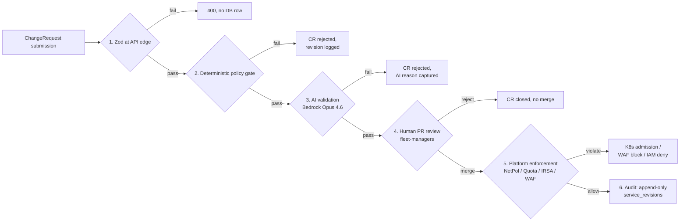

# Guardrails

Six independent defences. A bad ChangeRequest has to defeat every one to cause damage.



## Layer 1 — Zod at the API edge

`llm-product-poc/src/app/api/services/route.ts` validates the request body before any
database row exists. Field-by-field:

```typescript
const createServiceSchema = z.object({
  tenant_id: z.string().min(1),
  name: z.string().min(1).regex(/^[a-z0-9-]+$/),
  subdomain: z.string().regex(/^[a-z0-9-]*$/).optional().nullable(),
  vpn_internal: z.boolean().default(true),
  git_repo: z.string().url(),
  description: z.string().min(20),
});
```

**Observed in e2e:**

```
POST /api/services { ..., "description": "too short" }
  → HTTP 400 {"error":"validation_failed","issues":[
      {"code":"too_small","minimum":20,"path":["description"]}
    ]}
```

The DB never sees the row. No workflow runs. No tokens spent.

## Layer 2 — Deterministic policy gate

`llm-product-poc/src/lib/policy/gate.ts` runs after Zod, before the LLM. Fast cheap
checks that don't need a model:

- description ≥ 20 chars (also blocks an empty hostile payload)
- `git_repo` is an `https://` URL
- subdomain is unique within the tenant (Postgres unique index)
- tenant is not soft-deleted

If the gate trips, the CR is rejected without burning Bedrock tokens. The same code path
that handles AI rejection writes a `service_revisions` row with the violation. MVP2
substitutes this for a Rego policy bundle in `fleet-managers/policies/` evaluated by
Conftest — same logic, but versioned alongside the cluster manifests.

## Layer 3 — AI validation (Bedrock Opus 4.6)

`llm-product-poc/src/lib/ai/prompts.ts` ships a strict system prompt with the platform's
hard caps. The model is asked to **reject** (not silently clamp) when a CR violates a
rule. The decision is communicated through a single fenced output:

```
```reject
REASON: <one sentence>
```
```

The parser in `agent.ts` short-circuits to `kind: "rejected"` when it sees that fence,
and the orchestrator updates the CR status accordingly — no PR is opened.

### What the model is told to reject

| Rule | Cap |
| --- | --- |
| CPU per pod (request or limit) | ≤ 4 cores |
| Memory per pod | ≤ 8 Gi |
| Replicas | ≤ 20 |
| Image source | tenant ECR · docker.io/library · gcr.io/distroless · public.ecr.aws/* · ghcr.io |
| `privileged: true` | reject |
| `hostNetwork: true`, `hostPath`, `hostPID` | reject |
| Override of namespace `NetworkPolicy` or `ResourceQuota` | reject |
| Description shorter than 20 chars | reject (also caught by L1 / L2) |

### Observed rejections from the live e2e sweep

| CR | Status | AI reason |
| --- | --- | --- |
| 16 CPU per pod | `rejected` | "Requested 16 CPU per pod exceeds the 4-core cap (description explicitly states 16 CPU per pod)." |
| 50 replicas | `rejected` | "Requested replicaCount of 50 exceeds the 20-replica cap (description states 50 replicas)." |
| Untrusted image registry | `rejected` | "Image source \"random-pirate-registry.example.com\" is not the tenant's ECR or a well-known upstream (docker.io/library, gcr.io/distroless, public.ecr.aws/*, ghcr.io)." |
| Privileged + hostNetwork | `rejected` | "The service description explicitly requests a privileged container with hostNetwork enabled, which violates the platform security policy prohibiting privileged containers and hostNetwork." |

### Prompt caching

The system prompt (~1 KB) is identical across every CR. We send it with
`cache_control: ephemeral` so Bedrock reuses it across the 5-minute window — the second
invocation in that window pays ~0 input tokens for the system prompt. From a live log:

```
bedrock ok model=eu.anthropic.claude-opus-4-6-v1 ms=14210 tok_in=612 tok_out=1017 cache_read=0
bedrock ok model=eu.anthropic.claude-opus-4-6-v1 ms=1879  tok_in=1143 tok_out=61  cache_read=0
bedrock ok model=eu.anthropic.claude-opus-4-6-v1 ms=15078 tok_in=1136 tok_out=1227 cache_read=0
```

The rejection path is ~12× faster than the approval path (1.9 s vs 15 s) — short reject
fence vs. four code blocks.

## Layer 4 — Human pull-request review

The portal does not write to Kubernetes or AWS at runtime. The only thing it writes is
git, via `octokit/rest` against `nguyenhoangnam123/alice-ssp`. Each approved CR opens
a PR with four files:

```
fleet-managers/tenants/<domain>/apps/<svc>/values.yaml
fleet-managers/tenants/<domain>/apps/<svc>/Dockerfile         # frozen AI snapshot
fleet-managers/tenants/<domain>/apps/<svc>/build.yml          # GitHub Actions
fleet-managers/tenants/<domain>/apps/<svc>/application.yaml   # ArgoCD Application
```

`CODEOWNERS` requires platform-team approval. Until a platform engineer merges, ArgoCD
sees nothing new. This is the **last fully synchronous guardrail** — beyond this point
the loop is asynchronous (ArgoCD reconciles continuously).

A platform engineer reviewing the PR sees:
- Exactly which files will change
- The AI's `Current state` → `Desired state` rationale in the PR body
- The diff is the proposal — there is no out-of-band side-effect

## Layer 5 — Platform enforcement

After merge, ArgoCD reconciles the manifest into the tenant's namespace. Even if the AI
*and* the platform engineer collectively missed something, several runtime defences kick
in.

### NetworkPolicy

`fleet-managers/terraform/modules/tenant-namespace/main.tf` provisions a default-deny
NetworkPolicy with the only allowed sources being the namespace itself plus a
configurable allow-list (`ingress-nginx`, `argocd` by default). A tenant's pod cannot
reach another tenant's pod regardless of what the workload manifests claim.

### ResourceQuota + LimitRange

The same module sets a per-namespace quota (defaults: 2 CPU req / 4 Gi req / 4 CPU lim /
8 Gi lim / 20 pods) and a `LimitRange` providing per-container defaults. A tenant
manifest asking for more is rejected by the Kubernetes admission controller — even if
the AI somehow generated such a manifest.

### IRSA / Pod Identity

`fleet-managers/terraform/modules/tenant-iam/main.tf` creates a per-tenant IAM role with
two scoped policies:

- `bedrock:InvokeModel` on a small set of Anthropic foundation models
- `s3:Get/Put/DeleteObject` on the `tenants/<tenant_id>/*` S3 prefix only

The role's trust policy locks it to a specific ServiceAccount in the tenant's namespace
via the cluster's OIDC provider. A pod in tenant A literally cannot assume tenant B's
role.

### WAF on the public ALB

`fleet-managers/terraform/foundation/45-waf/main.tf` provisions a regional WAFv2 WebACL
attached to the Gateway-API public ALB. Rule groups:

- `AWSManagedRulesCommonRuleSet` (OWASP)
- `AWSManagedRulesKnownBadInputsRuleSet`
- `AWSManagedRulesAmazonIpReputationList`
- `AWSManagedRulesSQLiRuleSet`
- Custom **rate-limit-per-IP** = 2000 requests per rolling 5 min → 429

`Authorization` and `Cookie` headers are redacted from CloudWatch logs.

### TLS + ALB scheme

TLS termination uses an ACM cert issued in the same Terraform run as the Route53 zone,
validated via DNS records in the same hosted zone (so cert issuance never needs a manual
step). The Gateway's `LoadBalancerConfiguration` sets `scheme: internet-facing` for the
public ALB and `scheme: internal` for the VPN ALB — there's no path for an "internal"
service to accidentally become internet-facing because the GatewayClass is chosen by the
tenant's `vpnInternal` value, and the ALB scheme is set at the GatewayClass level by
the platform.

### Cognito hosted UI

`30-cognito` is configured with `allow_admin_create_user_only = true` — there is no
self-signup. New employees are invited by the platform team. Password policy is 12
chars + mixed case + numbers + symbols.

## Layer 6 — Append-only audit

Every state transition writes a `service_revisions` row. The row captures the AI
summary verbatim, the PR URL, and the frozen Dockerfile snapshot — so future engineers
debugging "why does this service have these resource caps?" can read the prompt the AI
saw and the response it gave. No revision is ever updated or deleted; the chain is
linear and the latest row reflects current truth.

The portal UI surfaces this as an accordion timeline on the service detail page —
clicking a revision expands the Current state / Desired state / AI summary panel and
collapses the previous one. Rejected revisions are highlighted red.

## What the guardrails do *not* do

Honest gaps for the reader:

- **The mock data path** — when `AI_MODE=mock` (used in CI), the validation step is
  bypassed because the deterministic template always approves. CI tests would need to
  exercise the policy gate directly.
- **The platform engineer is human** — they can merge a bad PR if the AI is convincing
  and they're tired. The runtime defences (L5) are the safety net for that.
- **No supply-chain check on the base image yet** — the AI is instructed to use trusted
  registries but we don't verify the image at admission time. MVP2 adds a sigstore /
  cosign policy enforced by Kyverno.
- **Pod Identity migration pending** — the tenant module still uses IRSA OIDC trust;
  switching the trust principal to `pods.eks.amazonaws.com` (Pod Identity) drops the
  OIDC setup but doesn't change the threat model.
